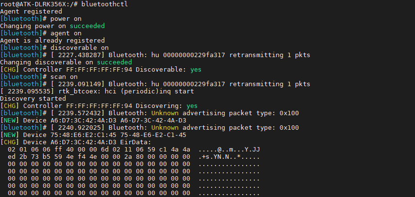
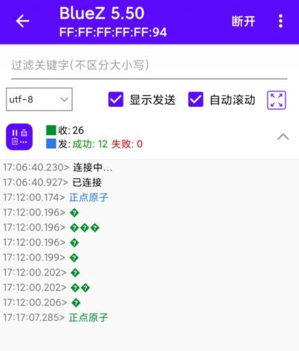

# 3.11 板载蓝牙测试

&emsp;&emsp;蓝牙开发依赖Buildroot，蓝牙驱动模块hci_uart.ko等文件都是Buildroot配置选择正确的Wi-Fi/BT模组的前提下才会生成。

&emsp;&emsp;蓝牙协议有非常多，如下。<br />
&emsp;&emsp;L2CAP: 逻辑链路控制和适配协议，用于建立和维护逻辑链路连接。<br />
&emsp;&emsp;RFCOMM: 远程串口协议，将串口设备的数据传输映射到蓝牙上。<br />
&emsp;&emsp;SDP: 服务发现协议，用于查找和描述可用的蓝牙服务。<br />
&emsp;&emsp;GAP: 通用访问协议，定义了设备之间的基本连接和通信规则。<br />
&emsp;&emsp;GATT: 通用属性协议，用于建立和管理设备之间的属性数据交换。<br />
&emsp;&emsp;ATT: 属性协议，用于在蓝牙设备之间传输属性值。<br />
&emsp;&emsp;HFP: 手机蓝牙耳机协议，用于手机和蓝牙耳机之间的音频通信。<br />
&emsp;&emsp;A2DP: 高级音频分发协议，用于在蓝牙设备之间传输高质量音频数据。<br />
&emsp;&emsp;AVRCP: 音频/视频远程控制协议，用于在蓝牙设备之间传输媒体控制命令。

&emsp;&emsp;笔者水平有限，蓝牙是一个很大的知识点，本次仅以演示蓝牙RFCOMM远程串口使用方法，其他协议可以自行研究。

&emsp;&emsp;Buildroot系统路径下就有板载的蓝牙驱动模块/system/lib/modules/hci_uart.ko。

## 3.11.1 蓝牙初始化

&emsp;&emsp;蓝牙初始化bt_init.sh脚本笔者已经提前放在/root/shell/bluetooth路径下，bt_init.sh的内容如下。实际上瑞芯薇也有一个bt_init.sh脚本，位于/usr/bin/路径下，笔者写的bt_init.sh做了一点优化。

```c#
#!/bin/bash
# 杀死进程，防止占用串口
if [[ "$(pidof rtk_hciattach)" != "" ]]
then
            kill -9 $(pidof rtk_hciattach)
fi
echo 0 > /sys/class/rfkill/rfkill0/state #下电
echo 0 > /proc/bluetooth/sleep/btwrite
sleep 1
echo 1 > /sys/class/rfkill/rfkill0/state #上电
echo 1 > /proc/bluetooth/sleep/btwrite
sleep 1
! test -d /sys/module/hci_uart && insmod /system/lib/modules/hci_uart.ko

rtk_hciattach -n -s 115200 /dev/ttyS8 rtk_h5 &
sleep 1
/usr/libexec/bluetooth/bluetoothd -C &
hciconfig hci0 piscan
```

&emsp;&emsp;上面的脚本中，蓝牙使用的是串口通信，使用的是串口是ttyS8，使用rtk_hciattach进行蓝牙初始化。

&emsp;&emsp;直接在串口终端输入bt_init.sh进行蓝牙初始化。看到下图红色框框内容后，说明蓝牙初始化成功。

```c#
/root/shell/bluetooth/bt_init.sh
```

<center>
<br />
图3.11.1 蓝牙初始化
</center>

## 3.11.2 蓝牙rfcomm

&emsp;&emsp;蓝牙RFCOMM是一种蓝牙协议，它提供了一种串行数据传输的方式，可以在蓝牙设备之间进行数据传输。RFCOMM可以将串行数据转换为蓝牙的数据包，从而实现无线传输。

&emsp;&emsp;RFCOMM提供了一种虚拟串口的概念，使得蓝牙设备之间的数据传输可以像串口一样进行。这种方式广泛应用于蓝牙耳机、蓝牙打印机等设备上。

&emsp;&emsp;在使用RFCOMM进行数据传输时，需要先建立蓝牙连接，并且指定RFCOMM通道。然后，在连接两端的设备中，可以通过RFCOMM发送和接收数据。这种方式适用于需要进行串口通信的应用场景，例如无线控制器、无线传感器等。

&emsp;&emsp;笔者编写了开启蓝牙rfcomm建立rfcomm通道的脚本，位于/root/shell/bluetooth/rfcomm_init.sh。脚本的内容如下。

```c#
if [[ "$(pidof rfcomm)" != "" ]]
then
    kill -9 $(pidof rfcomm)
fi
hciconfig hci0 piscan
hciconfig hci0 noauth
sleep 1
sdptool add SP
sleep 1
rfcomm watch hci0 &
echo "rfcomm init finished! please use bluetoothctl cmd to pair your device and then connect it!"
```

&emsp;&emsp;执行rfcomm_init.sh脚本，可以看到已经创建了通道1，等待连接。

```c#
rfcomm_init.sh
```


<center>
<br />
图3.11.2 开启rfcomm	
</center>


## 3.11.3 蓝牙配对

&emsp;&emsp;输入下面指令，进入bluetoothctl交互模式。

```c#
bluetoothctl
```

&emsp;&emsp;依次执行下面指令。

```c#
power on                  # 打开电源
agent on                  # 开启代理
discoverable on           # 开启可被检测
scan on                   # 开启扫描设备
```

<center>

</center>

等到扫描到自己的蓝牙设备，输入scan off停止扫描。

```c#
scan off
```

&emsp;&emsp;如下图，笔者扫描到安卓手机蓝牙MAC地址，确认后就可以进行配对了。


<center>

</center>

&emsp;&emsp;输入下面指令进行配对。

```c#
pair 60:AB:67:65:93:E8				# 请填写你自己的蓝牙MAC
```

<center>

</center>

&emsp;&emsp;手机端也弹出配对码。

<center>

</center>

&emsp;&emsp;输入下面的指令信任MAC。

```c#
trust 60:AB:67:65:93:E8				# 请填写你自己的蓝牙MAC
```

<center>

</center>

## 3.11.4 蓝牙通信测试

&emsp;&emsp;安卓手机安装蓝牙调试宝，打开软件后，已经配对和未配对的蓝牙会显示在列表里（如果搜索不到，可能是需要再开启被扫描），如下图发现模式被关闭了。需要执行discoverable on或者退出交互终端后执行hciconfig hci0 piscan再次开启。


<center>

</center>

&emsp;&emsp;蓝牙调试宝，打开软件后，已经配对蓝牙显示如下图。

<center>

</center>

&emsp;&emsp;点击连接，默认uuid即可，可以看到下图，已经连接上了。可以进行数据收发了。

<center>

</center>

&emsp;&emsp;板子接收数据可以使用cat指令进行收数据。

```c#
cat /dev/rfcomm0
```

&emsp;&emsp;然后在手机向开发板发送数据，如下图。

<center>

</center>


&emsp;&emsp;开发板收到的数据如下。

<center>

</center>

&emsp;&emsp;同理，我们可以向手机发送数据。执行下面指令。

```c#
echo "正点原子" > /dev/rfcomm0
```

<center>

</center>

<center>

</center>


