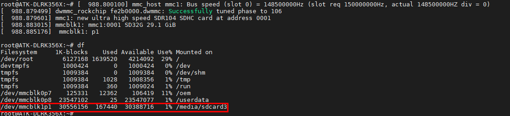
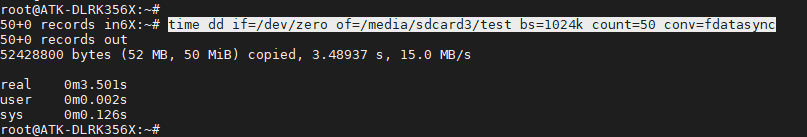
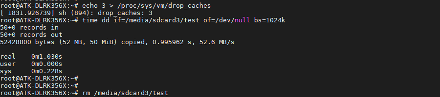
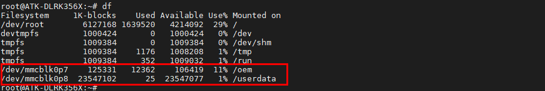
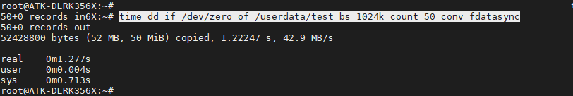
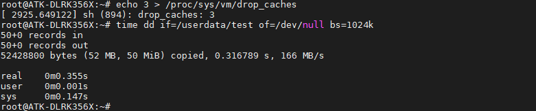

# 3.12 TF(SD)卡&EMMC测试

&emsp;&emsp;指令提示：

&emsp;&emsp;time命令常用于测量一个命令的运行时间，dd 用于复制，从 if(input file)文件读出，写到 of(output file)指定的文件，bs 是每次写块的大小，count 是读写块的数量。"if=/dev/zero"不产生 IO，即可以不断输出数据，因此可以用来测试纯写速度。


## 3.12.1 SD卡测试

&emsp;&emsp;开发板启动后将TF卡插到开发板底板卡槽处，打印信息如下。开发板会将TF卡自动挂载。（注意需要使用FAT32格式的TF卡，不能使用NTFS格式）。

&emsp;&emsp;使用df -h命令，查看SD挂载的分区。运行结果如下所示：


<center>

</center>

&emsp;&emsp;读取速度测试，常用于测试硬盘读取速度指令有hdparm与dd，本次只演示hdparm读取TF卡的速度，数据采样时间过短，数据量少，速度仅供参考。

```c#
hdparm -t /dev/mmcblk1p1
```

<center>
<br />
图3.12.1.1 读取速度评测
</center>

&emsp;&emsp;可以看出读取速度为63737KB/s。

&emsp;&emsp;写速度测试

```c#
time dd if=/dev/zero of=/media/sdcard3/test bs=1024k count=50 conv=fdatasync #注意指令过长，导致指令显示异常，但不影响操作。
```

<center>

</center>

&emsp;&emsp;使用dd指令读，因为 Linux系统机制，一般情况下不需要特意去释放已经使用的 cache。这些 cache 内容可以增加文件的读写速度。

&emsp;&emsp;执行下面指令清除缓存。

```c#
echo 3 > /proc/sys/vm/drop_caches      #清除缓存
time dd if=/media/sdcard3/test of=/dev/null bs=1024k   #读取速度测试
rm /media/sdcard3/test                 #读完将此文件删除
```

<center>

</center>

&emsp;&emsp;可以看出读取速度为52.6MB/s。速度仅供参考，读取的文件越大，速度越准确。

## 3.12.2 EMMC测试

&emsp;&emsp;使用df -h命令确定，EMMC挂载的分区。运行结果如下所示，实际上eMMC存储被分成了许多个分区，挂载在“/”根目录下的也是eMMC分区，这里我们以mmcblk0p8分区挂载目录为/userdata为例。

<center>

</center>

&emsp;&emsp;读取速度测试

```c#
hdparm -t /dev/mmcblk0p8
```

<center>

</center>

&emsp;&emsp;	可以看出读取速度为164456KB/s。

&emsp;&emsp;写速度测试

```c#
time dd if=/dev/zero of=/userdata/test bs=1024k count=50 conv=fdatasync #注意指令过长，导致指令显示异常，但不影响操作。
```

<center>

</center>

&emsp;&emsp;可以看出写速度为42.9MB/s。

&emsp;&emsp;使用dd指令读，因为 Linux系统机制，一般情况下不需要特意去释放已经使用的 cache。这些 cache 内容可以增加文件的读写速度。

&emsp;&emsp;执行下面指令清除缓存。

```c#
echo 3 > /proc/sys/vm/drop_caches     #清除缓存
time dd if=/userdata/test of=/dev/null bs=1024k   #读取速度测试
rm /userdata/test                     #读完将此文件删除
```

<center>

</center>

&emsp;&emsp;可以看出读取速度为166MB/s，读取文件过小，速度仅供参考。


