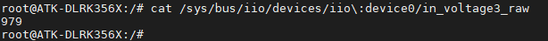

# 3.13 ADC测试

&emsp;&emsp;注意：ADC的采集电压绝对值最大是1.8V，请不要超过 1.8V，否则可能对芯片造成损坏。

&emsp;&emsp;ATK-DLRK3568底板上丝印VR处有一路ADC方便用户测试。电位器连接ADC3接口，如下图所示：

<center>
<br />
图3.13.1 电位器图
</center>

&emsp;&emsp;在Linux系统中，ADC采样属于IIO子系统下，可以通过SYSFS提供的接口来访问ADC控制器，使用的是10位精度。使用以下命令查看ADC采集的原始数据：

```c#
	cat /sys/bus/iio/devices/iio\:device0/in_voltage3_raw
```

<center>

</center>

&emsp;&emsp;使用标准电压将 AD 转换的值转换为用户所需要的电压值。其计算公式如下：

```c#
Vref / (2^n-1) = Vresult / raw
```

&emsp;&emsp;注意：Vref为标准电压，n为AD转换的位数，raw为AD采集的原始数据，Vresult为用户所需要采集的电压。

```c#
Vresult = (1800mv * 979) /1023 = 1722.58mv
```

&emsp;&emsp;通过公式我们可以计算出大概为1.7V左右。
