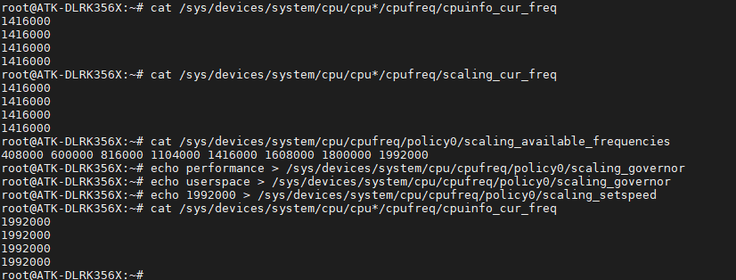

# 3.15 CPU频率

&emsp;&emsp;命令如下所示：

&emsp;&emsp;查看当前运行CPU频率

```c#
cat /sys/devices/system/cpu/cpu*/cpufreq/cpuinfo_cur_freq
```

&emsp;&emsp;查看软件上最后一次设置的CPU频率

```c#
cat /sys/devices/system/cpu/cpu*/cpufreq/scaling_cur_freq	
```

&emsp;&emsp;查看支持的CPU频率

```c#
cat /sys/devices/system/cpu/cpufreq/policy0/scaling_available_frequencies 
```

&emsp;&emsp;使能CPU性能模式，跑最高频

```c#
echo performance > /sys/devices/system/cpu/cpufreq/policy0/scaling_governor	
```

&emsp;&emsp;切换governor到userspace

```c#
echo userspace > /sys/devices/system/cpu/cpufreq/policy0/scaling_governor 
```

&emsp;&emsp;设置CPU频率 需要先切换到userspace

```c#
echo 1992000 > /sys/devices/system/cpu/cpufreq/policy0/scaling_setspeed  
```

&emsp;&emsp;再查看当前运行CPU频率

```c#
cat /sys/devices/system/cpu/cpu*/cpufreq/cpuinfo_cur_freq
```

<center>

</center>


