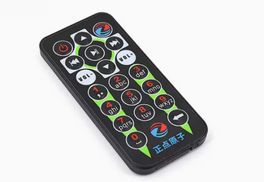

# 3.16 红外测试

&emsp;&emsp;板载红外模块底板丝印为U25位置，如下图。

<center>

</center>

&emsp;&emsp;我们需要找到一个红外遥控器（红外遥控器属于非开发板配件，请自行配备），比如正点原子店铺的红外遥控模块，如果你手头上有其它红外遥控器也可以测试。注意不同遥控器编码可能不一样。如果你使用了正点原子店铺的遥控器那么你输入数字“1”，那么开发板将会解码为“1”，依次类推。

## 3.16.1 适用多种红外遥控测试

&emsp;&emsp;如果你手上有红外遥控器，如空调的都行。执行下面的指令开启红外信息打印。本次使用格力空调红外遥控器与正点原子红外遥控器模块测试。

```c#
echo 1 > sys/module/rockchip_pwm_remotectl/parameters/code_print
```

<center>

</center>

&emsp;&emsp;可以看到上面的遥控器在不解码的情况下，我们根本不知道它这个数据是什么。

## 3.16.2 适用正点原子红外遥控模块

&emsp;&emsp;如下图，此模块为正点原子店铺一个红外遥控器，常用于stm32开发板上，我们ATK-DLRK3568开发板已经将它的红外编码解码为对应的按键或者功能键了。例如输入数字“1”，就能识别为数字“1”。


<center>

</center>

&emsp;&emsp;测试程序位于/opt/apps/src/pcba/infrared_test。此测试程序路径为**开发板光盘A盘-基础资料01、程序源码外设测试源码**。

&emsp;&emsp;现在我们执行下面的指令来测试这个遥控器。

&emsp;&emsp;先关闭打印信息。再执行测试程序。

```c#
echo 0 > sys/module/rockchip_pwm_remotectl/parameters/code_print
/opt/apps/src/pcba/infrared_test
```

<center>

</center>

&emsp;&emsp;可以看到对应的按键已经被解码成对应的数值。


