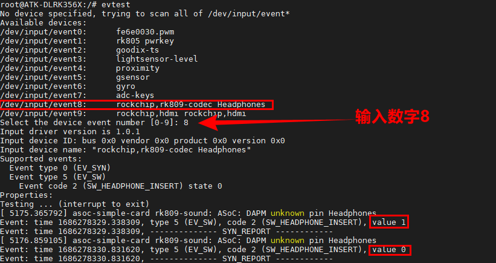

# 3.17 耳机插拨测试

&emsp;&emsp;用一个三段式的耳机插头，对准开发板上的耳机孔进行测试。耳机插拨无非就是一种“事件”，我们可以使用evtest程序进行测试。（**注意：最新固件已经删除这个耳机插拨驱动，请更新到最新固件，最新固件播放音乐时，插上耳机，喇叭则不会有声音，说明耳机插拨正常，若你更新到最新固件，下面耳机插拨不用测试了**）。

&emsp;&emsp;执行evtest指令，查看相应的事件如下图，插拨耳机会打印相应的信息。


<center>

</center>

&emsp;&emsp;或者我们也可以使用程序来检测耳机的插拨，测试程序位于/opt/apps/src/pcba/hp_det_test。此测试程序源码路径为**开发板光盘A盘-基础资料->01、程序源码->外设测试源码**。

&emsp;&emsp;执行下面的指令进行耳机插拨测试。

```c#
/opt/apps/src/pcba/hp_det_test
```


