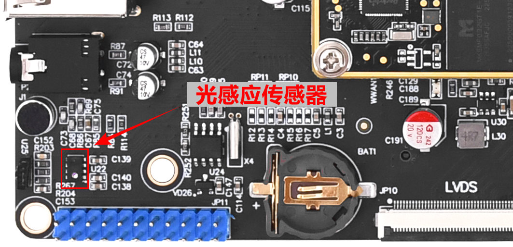
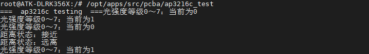

# 3.18 光感应器AP3216C测试

&emsp;&emsp;AP3216C 简介：

&emsp;&emsp;ATK-DLRK3568开发板上通过 I2C5 连接了一个三合一环境传感器：AP3216C，AP3216C 是由敦南可以推出的一款传感器，其支持环境光强度(ALS)、接近距离(PS)和红外线强度(IR)这三个环境参数检测。AP3216C 的特点如下： 

&emsp;&emsp;①、I2C 接口，快速模式下波特率可以到 400Kbit/S<br />
&emsp;&emsp;②、多种工作模式选择：ALS、PS+IR、ALS+PS+IR、PD 等等。<br />
&emsp;&emsp;③、内建温度补偿电路。<br />
&emsp;&emsp;④、宽工作温度范围(-30°C ~ +80°C)。<br />
&emsp;&emsp;⑤、超小封装，4.1mm x 2.4mm x 1.35mm<br />
&emsp;&emsp;⑥、环境光传感器具有 16 为分辨率。<br />
&emsp;&emsp;⑦、接近传感器和红外传感器具有 10 为分辨率。

&emsp;&emsp;AP3216C 常被用于手机、平板、导航设备等，其内置的接近传感器可以用于检测是否有物体接近，比如手机上用来检测耳朵是否接触听筒，如果检测到的话就表示正在打电话，手机就会关闭手机屏幕以省电。也可以使用环境光传感器检测光照强度，可以实现自动背光亮度调节。

&emsp;&emsp;进入开发板文件系统执行下面指令读取环境传感器的环境参数值，根据开发板所处环境不同，环境参数值不同，先用下面指令读取一次环境参数值，再用手接近 AP3216C 传感器。

&emsp;&emsp;在正点原子ATK-DLRK3568开发板上常用ALS&PS来测量光环境强度与物体的接近距离。

&emsp;&emsp;传感器的位置如下图。

<center>

</center>

&emsp;&emsp;测试程序位于/opt/apps/src/pcba/ap3216c_test。此测试程序路径为**开发板光盘A盘-基础资料->01、程序源码->外设测试源码**。
	
&emsp;&emsp;执行下面的指令测试AP3216C是否正常工作。用手指接近传感器，会打印如下图信息。

```c#
/opt/apps/src/pcba/ap3216c_test
```

<center>

</center>


