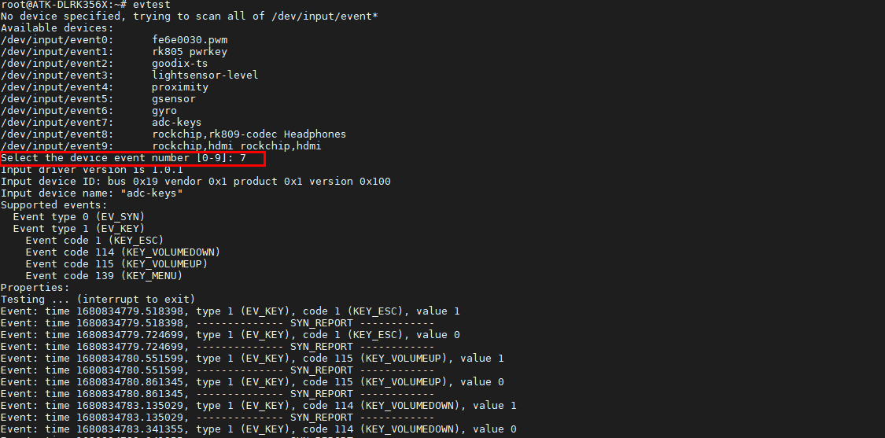

# 3.2 按键测试

&emsp;&emsp;正点原子ATK-DLRK3568开发板上有配备7个按键。其中4个按键是用ADC0模拟，按键按下去ADC0有不同的电压变化。

<div class="clrk3568f_center-table-div">
<table class="clrk3568f_center-table">
  <tr>
    <th> </th>
    <th>KEY4</th>
    <th>KEY5</th>
    <th>KEY6</th>
    <th>KEY7</th>
  </tr>
  <tr>
    <td>按键的名称</td>
    <td>V+</td>
    <td>V-</td>
    <td>MENU</td>
    <td>ESC</td>
  </tr>
  <tr>
    <td>ADC0的值</td>
    <td>9</td>
    <td>235</td>
    <td>457</td>
    <td>683</td>
  </tr>
</table>
</div>

&emsp;&emsp;在开发板串口终端下运行以下命令进行测试，然后输入数字“7”，因为按键事件为event7。如需要停止测试按Ctrl + c。请按下开发板上的以上四个键，请不要按到其他键，如复位键REST等。

```c#
	evtest
```

&emsp;&emsp;运行结果如下所示，可以看到按对应的按键就会打印对应的按键类型和按下时值为1，松开即为0。


<center>

</center>


