# 3.23 5G模块接口测试

## 3.23.1 5G模块上网测试

&emsp;&emsp;请准备型号为RM500U-CN移远5G模块并接上天线，有需要请联系移远官方购买。如下图。已经在正点原子ATK-DLRK3568开发板支持。注意必须是这种型号的5G模块！5G模块接口在开发板背面，SIM卡接口也在背面。

&emsp;&emsp;5G模块和天线如下图。


<center>
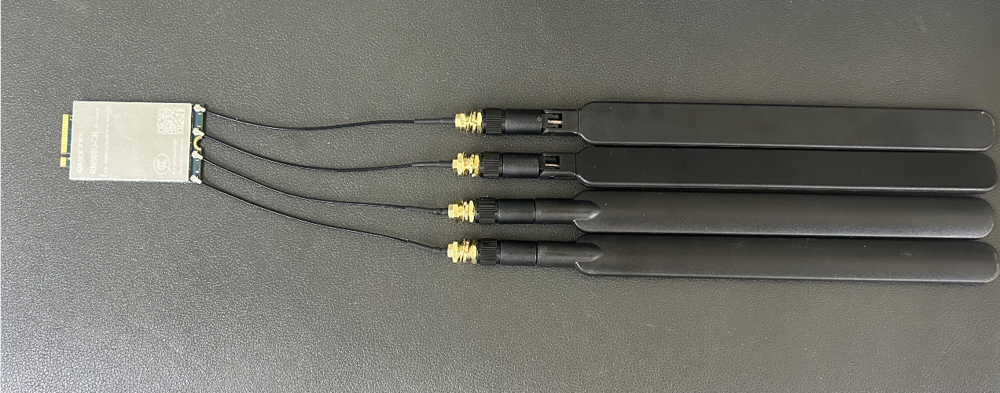
</center>

&emsp;&emsp;开发板请断电，插上5G模块与SIM卡（支持全网通）。如下图，用一张普通的SIM卡，插在SIM卡槽里。固定5G模块，需要使用移远的RM500U-CN 5G模块。

<center>
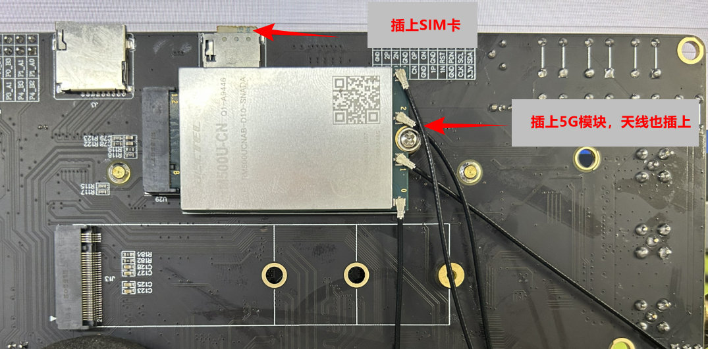
</center>

&emsp;&emsp;上电后，终端打印如下信息，说明5G模块驱动加载成功。

<center>
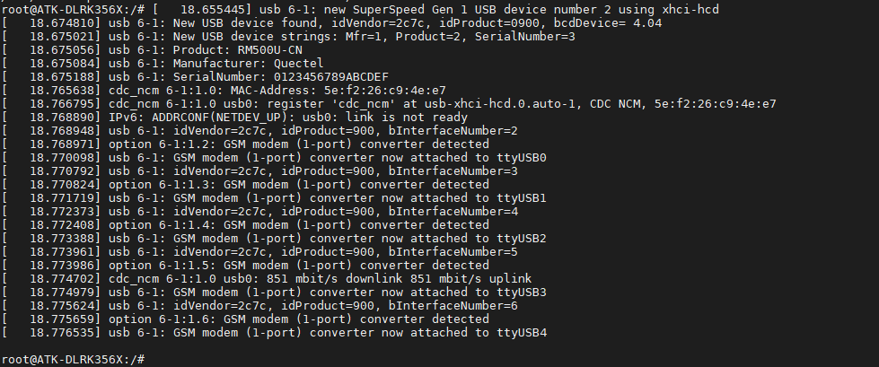
</center>

&emsp;&emsp;查看模块ID，使用lsusb指令。

<center>
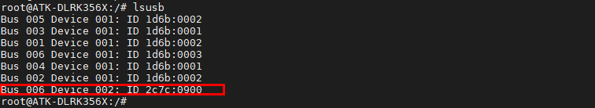
</center>

&emsp;&emsp;现在我们只需要通过简单的几步就可以使用5G模块上网。在命令行下执行下面指令。其中ttyUSB2是驱动提供的接口，可以下发AT指令配置模块。如果没有ttyUSB2节点，说明模块没有初始化。

```c#
microcom /dev/ttyUSB2 -s 115200
```

<center>
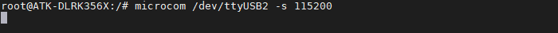
</center>


### 3.23.1.1 配置驱动类型

&emsp;&emsp;支持的驱动类型有以下几种，我们只需要配置为其中一种即可。详细请自行查找相关说明文档。配置将记录在模块中，下次不用重新配置。

&emsp;&emsp;`AT+QCFG="usbnet",5` 配置网卡拨号方式及驱动类型为 NCM；<Br />
&emsp;&emsp;`AT+QCFG="usbnet",1` 配置网卡拨号方式及驱动类型为 ECM；<br />
&emsp;&emsp;`AT+QCFG="usbnet",2 `配置网卡拨号方式及驱动类型为 MBIM；<br />
&emsp;&emsp;`AT+QCFG="usbnet",3` 配置网卡拨号方式及驱动类型为 RNDIS。

&emsp;&emsp;我们选择第一个即可，就是配置成AT+QCFG="usbnet",5这个驱动类型。

&emsp;&emsp;参数配置重启后生效。建议开机时通过 AT+QCFG="usbnet"查询当前配置；若当前配置和期望不同，可按上述方法进行配置并重启模块。

&emsp;&emsp;输入AT指令配置驱动类型，回车，可能返回结果失败，我们再配置几次直到成功。

```c#
 AT+QCFG="usbnet",5
```

<center>
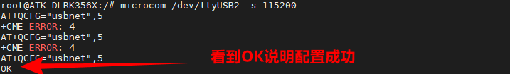
</center>

&emsp;&emsp;输入AT指令查询驱动类型，回车，可以看到是我们配置的“5”，为NCM驱动类型。

```c#
AT+QCFG="usbnet"
```

<center>
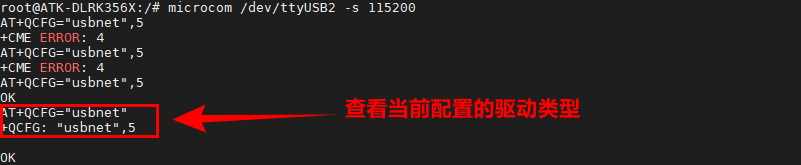
</center>

### 3.23.1.2 配置拨号模式

&emsp;&emsp;拨号模式有以下几种，我们需要配置为网卡模式。配置将记录在模块中，下次不用重新配置。

&emsp;&emsp;`AT+QCFG="nat",0` 配置拨号模式为网卡模式；<br />
&emsp;&emsp;AT+QCFG="nat",1 配置拨号模式为路由模式；<br />
&emsp;&emsp;AT+QCFG="nat",2 配置拨号模式为网桥模式。<br />

&emsp;&emsp;参数配置重启后生效。建议开机时通过 AT+QCFG="nat"查询当前配置；若当前配置和期望不同，可按上述方法进行配置并重启模块。

&emsp;&emsp;输入AT指令配置拨号模式，回车，可能返回结果失败，我们再配置几次直到成功。

```c#
AT+QCFG="nat",0
```

<center>
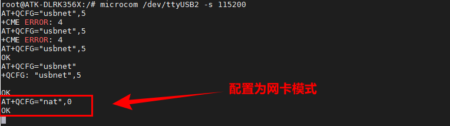
</center>

&emsp;&emsp;输入AT指令查询拨号模式，回车。可以看到是我们配置的“0”，为网卡模式。

<center>
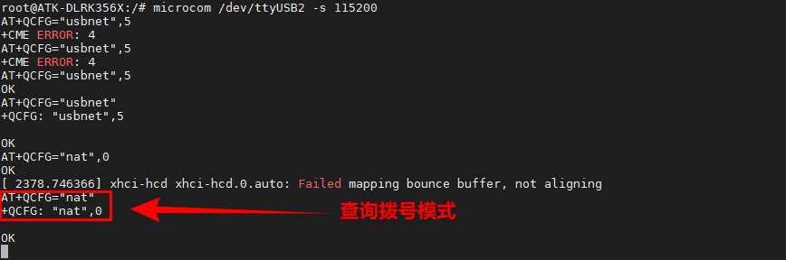
</center>

&emsp;&emsp;按Ctrl +x组合键退出交互模式，然后重启开发板。


### 3.23.1.3 上网测试

&emsp;&emsp;配置完成后重启开发板，等待一小会，输入ifconfig指令查看获取到的ip地址。

```c#
ifconfig
```

<center>
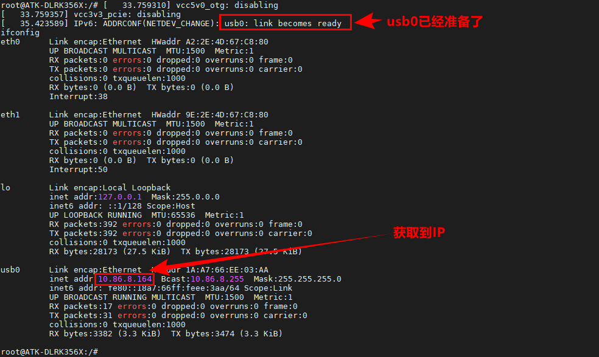
</center>

&emsp;&emsp;检验能不能上网，肯定是通过ping外网了。执行ping百度的指令。-I选项是指定网卡设备。

```c#
ping www.baidu.com -I usb0
```

<center>
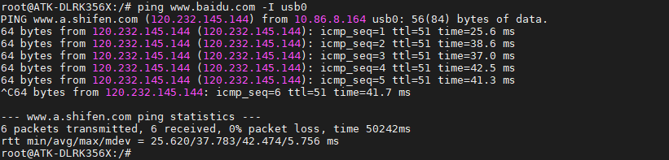
</center>

&emsp;&emsp;看到有数据回复，说明5G模块可以上网。


## 3.23.2 4G模块上网测试

&emsp;&emsp;5G模块接口也兼容4G模块，目前正点原子兼容的4G模块型号为移远的EM05-CE。由于EM05-CE 4G模块比5G模块短了一截，所以在开发板的背面是没有办法固定的，测试时只能够用胶布粘住！

&emsp;&emsp;下图为4G模块与5G模块的大小对比。

<center>
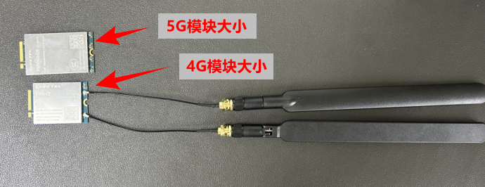
</center>

&emsp;&emsp;开发板请断电，插上4G模块与SIM卡（支持全网通）。如下图，用一张普通的SIM卡，插在SIM卡槽里。固定4G模块，需要使用移远的EM05-CE 4G模块。

<center>
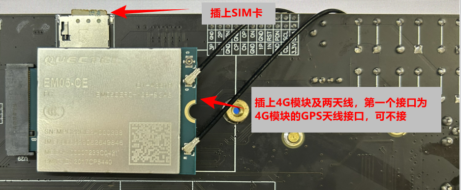
</center>

&emsp;&emsp;同理需要查看/dev/下是否产生/dev/ttyUSB2节点。

```c#
ls /dev/ttyUSB*
```

<center>
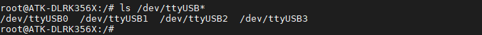
</center>

&emsp;&emsp;与5G模块一样，4G模块也支持许多种驱动类型。笔者这里只写一种，更多驱动类型，请查看此4G模块资料。


### 3.23.2.1 拨号测试

&emsp;&emsp;本次测试的是MBIM驱动类型，需要用到的程序笔者已经集成到/usr/bin/目录下了。查看这些程序，使用ls指令。下图中Quectel*都是移远的测试程序。

```c#
ls /usr/bin/quectel*
```

<center>
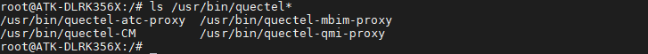
</center>

&emsp;&emsp;直接执行quectel-CM -s ctnet &就可以拨号上网了。

<center>
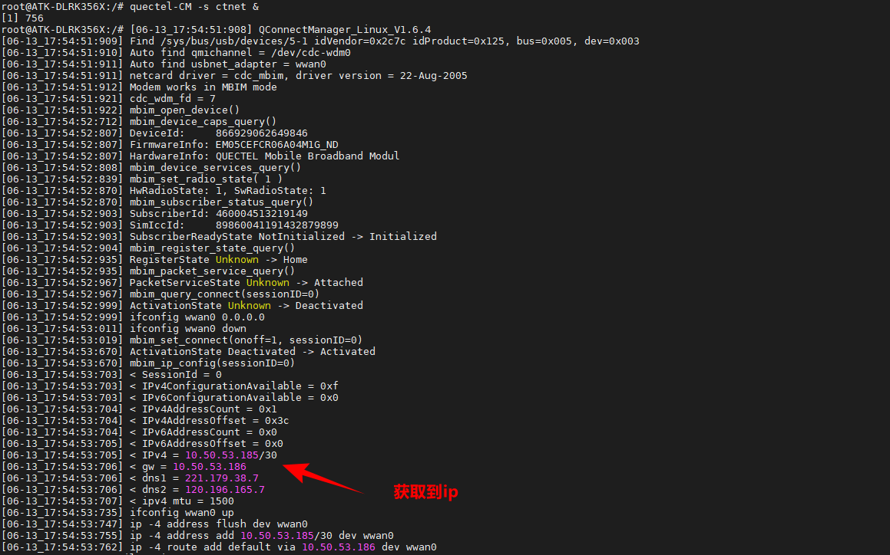
</center>

&emsp;&emsp;使用ifconfig指令查看对应的网卡名称，可以看到下图为wwan0。

<center>
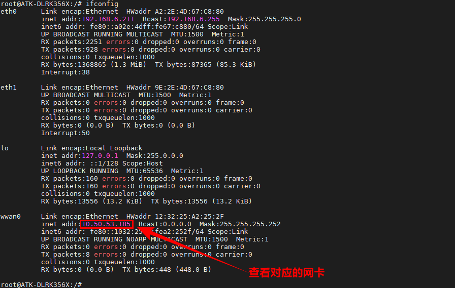
</center>

### 3.23.2.2 上网测试

&emsp;&emsp;检验能不能上网，肯定是通过ping外网了。执行ping百度的指令。-I选项是指定网卡设备。

```c#
ping www.baidu.com -I wwan0
```

<center>
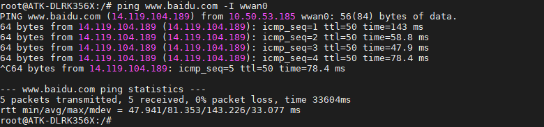
</center>

&emsp;&emsp;上图中可以看到有数据回复，说明4G模块工作正常。


