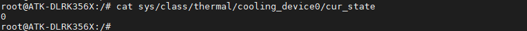

# 3.25 CPU散热风扇测试

&emsp;&emsp;CPU散热风扇属于选配配件，若你选配了散热风扇那么可以按下面的操作测试风扇是否正常工作。

&emsp;&emsp;请将风扇安装于核心板上，直接将风扇两个自锁座子对准核心上预留的两个孔位安装上去即可。卸下即需要拆下核心板，从核心板背面将自锁座子卸下即可。

&emsp;&emsp;ATK-DLRK3568开发板正常上电时CPU散热风扇会转动一会，过了一会温控系统正常初始化后，风扇就会停下来，并不会一直转。这是因为没有到温控域值，CPU温度超过了35度才会开启风扇进行散热，这样的目的是为了降低整个开发板的功耗。（注意：V1.1版本资料才将CPU温度改为了35度，因为V1.0版本是固件设置为温控域值为64度，但是这个64度在linux下难达到，所以改为了35度，防止用户以为风扇是坏的）

&emsp;&emsp;什么时候CPU温度才会超过35度？常温下如果开发板接的外设少，可能难达到35度，风扇将不会启动。想要风扇启动，需要将CPU负载状态接近跑满状态才会启动风扇。

&emsp;&emsp;实际上我们也可以手动开启风扇，首先我们需要关闭温控策略，执行下面的指令。

```c#
echo disabled > /sys/class/thermal/thermal_zone0/mode
```

&emsp;&emsp;查看当前风扇风力等级，默认分了22个等级。

```c#
cat /sys/class/thermal/cooling_device0/cur_state
```

<center>

</center>

&emsp;&emsp;设置风力等级，设置cur_state为10。设置不同的等级可设置为0~22，值越大，风扇转速越快。

```c#
echo 10 > /sys/class/thermal/cooling_device0/cur_state
```

<center>

</center>

&emsp;&emsp;实际应用中不建议关闭温控策略，本实验仅测试风扇正常工作。


