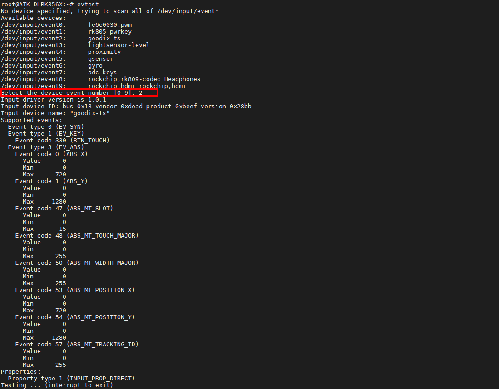
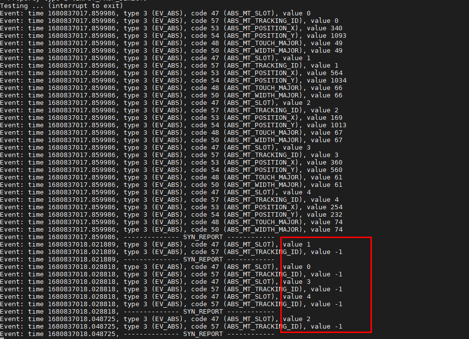

# 3.3 显示与触摸测试

&emsp;&emsp;在出厂系统里，因为正点原子的屏幕排线有ADC管脚连接到CPU上，所以出厂系统会识别加载不同屏的分辨率。正点原子所使用的MIPI屏幕有三种，如下表所示：

<div class="clrk3568f_center-table-div">
<table class="clrk3568f_center-table">
  <tr>
    <th>屏幕尺寸</th>
    <th>触摸芯片</th>
    <th>ADC值</th>
  </tr>
  <tr>
    <td>5.5英寸屏(720x1280)</td>
    <td>gt911</td>
    <td>0</td>
  </tr>
  <tr>
    <td>5.5英寸屏(1080x1920)</td>
    <td>gt911</td>
    <td>340</td>
  </tr>
  <tr>
    <td>10.1英寸</td>
    <td>gt928</td>
    <td>700</td>
  </tr>
</table>
</div>

## 3.3.1 触摸测试

&emsp;&emsp;开发板启动后我们使用evtest指令查看触摸屏对应的触摸事件，与3.2小节一样的方法也可以测试屏幕是否正常触摸，输入数字2，屏的对应驱动为goodix-ts。当然你点击出厂时的Qt界面，能正常触摸也是可以的。

## 3.3.2 多点触摸测试

&emsp;&emsp;MIPI屏幕最大支持5点触摸，Qt虽然支持多点触摸，但是我们使用的控件都是单点的。多点触摸要使用多点触摸的程序。所以在出厂的界面时，你无法体验到多点触摸。

&emsp;&emsp;所以我们还是使用evtest指令测试，当时你可以使用tslib测试（默认文件系统没有配置）。同理与3.2小节一样的方法也可以测试屏幕是否正常触摸，输入数字2，屏的对应驱动为goodix-ts。

<center>

</center>


&emsp;&emsp;可以看到如下，5个手指同时按下，value为正数时代表点的个数，为负数时代表该点松开。一共有5个点，5点触摸测试正常。

<center>

</center>

## 3.3.3 MIPI背光测试

&emsp;&emsp;MIPI屏幕的背光支持255个等级的pwm调节，亮度级数为 0～255，默认为255。数值越大，屏幕越亮。

```c#
cat /sys/class/backlight/backlight1/max_brightness #查看lcd最大亮度等级
cat /sys/class/backlight/backlight1/brightness #查看当前亮度等级
echo 255 > /sys/class/backlight/backlight1/brightness #修改当前亮度等级观察屏的亮度变化
cat /sys/class/backlight/backlight1/brightness #再查看当前亮度等级
```

## 3.3.4 LVDS和EDP屏幕背光测试

&emsp;&emsp;注意，请烧写对应屏幕种类的镜像再测试，在硬件上，由于没有多的PWN可以给LVDS和EDP屏幕使用，所以它们共用一路径PWN。与上一小节一样。如果你有接EDP或者LVDS屏幕。那么你可以使用以下指令调整屏幕的背光。

```c#
cat /sys/class/backlight/backlight/max_brightness #查看lcd最大亮度等级
cat /sys/class/backlight/backlight/brightness #查看当前亮度等级
echo 255 > /sys/class/backlight/backlight/brightness #修改当前亮度等级观察屏的亮度变化
cat /sys/class/backlight/backlight/brightness #再查看当前亮度等级
```

## 3.3.5 HDMI测试

&emsp;&emsp;默认出厂系统就支持HDMI，请使用HDMI线连接显示器测试显示即可。注意：出厂Qt界面适配1080*1920、800*1280和720*1280分辨率的屏幕，其他分辨率不做适配。若需要恢复横屏显示，请输入下面指令（更多与屏相关设置请看RK官方文档Rockchip_Developer_Guide_Buildroot_Weston_CN.pdf）。

```c#
echo "output:HDMI-A-1:rotate0" > /tmp/.weston_drm.conf
```


