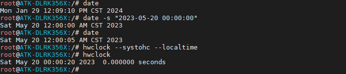

# 3.4 RTC时钟测试

&emsp;&emsp;ATK-DLRK3568开发板有两个硬件时钟，一个是核心板上的RK809内部的RTC时钟，另外一个是底板上RTC时钟芯片AT8563T，都属于芯片外部RTC时钟。若需要提高时钟的精度，需要用高精度的晶振。

&emsp;&emsp;请检查开发板底板上是否有安装RTC纽扣电池。也可以用万用表检查RTC电池有没有电，测出来是3.3v左右才是正常的。防止因RTC电池没电不能保存时间。（注意，电池属于易耗品，若没电请更换纽扣电池）

&emsp;&emsp;Linux系统分两个时钟，一个是system time（软件时钟），一个是hardware clock（硬件时钟）。使用date和hwclock命令可分别查看和设定系统时间和硬件时间。系统时钟掉电即会消失，RTC 时钟在有电池的情况下会长期运行。系统时钟会在系统重启时与 RTC 时钟同步。

&emsp;&emsp;查看系统时钟，使用指令date。注意出厂系统系统时钟使用了ntpd时钟同步服务，所以你开机时如果有插上网线，并且能联网，那么你的系统时钟将会与网络上的时钟同步。但是这个同步的时钟并不会写入到硬件时钟里。所以你用date和hwclock可能会看到两个不同的时间。

```c#
date
```

&emsp;&emsp;设置当前系统时钟	

```c#
date -s "2023-05-20 00:00:00"
```

&emsp;&emsp;查看系统时钟

```c#
date	
```

&emsp;&emsp;使用hwclock写入硬件时钟，--localtime参数是根据系统时区设置。

```c#
hwclock --systohc --localtime	
```

&emsp;&emsp;查看硬件时钟，检查是否是上面hwclock -w所设置的时钟

```c#
hwclock
```

<center>

</center>

&emsp;&emsp;注意上面的操作只会写RTC0，而RTC0就是核心板上的RK809内部硬件RTC时钟。RTC1则是AT8563T（**注意：最新内核已经去除RK809RTC驱动，默认就是使用底板上的AT8563T驱动，因为使用RK809RTC驱动掉电不保存，存在也没意义，也方便用户保存时间。如果你的内核还存在RTC0和RTC1，请更新到最新内核**）。若需要操作RTC1，按下面的操作。

&emsp;&emsp;将当前时间写入RTC1，注意读RTC之前需要写一次RTC才可以读。

```c#
hwclock --systohc --rtc=/dev/rtc1 --localtime
```

&emsp;&emsp;读取rtc1的时间。

```c#
hwclock -f /dev/rtc1 --show
```

<center>

</center>

&emsp;&emsp;注意：由于开机系统是读取RTC0的时间，也就是核心板上的RK809内部硬件时钟，但是这个硬件时钟在核心板上是断电后就不会供电了，还在工作的时钟就是RTC1，因为接了后备电池。你可以在自启动脚本中添加同步时钟的指令。


