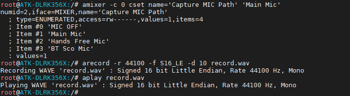
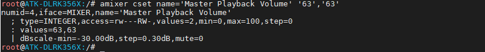
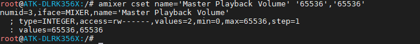
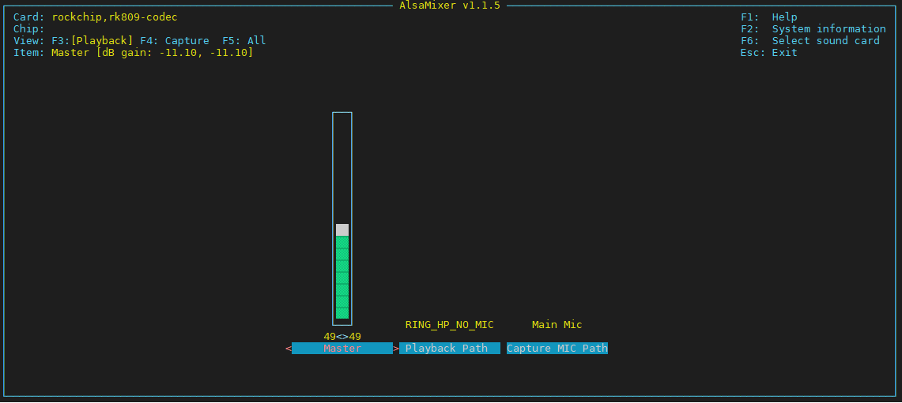
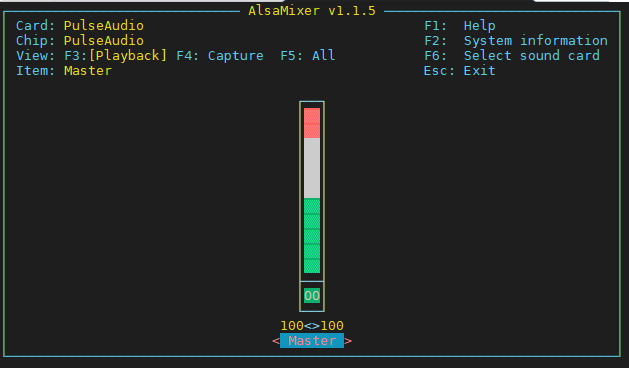

# 3.5 音频测试

&emsp;&emsp;ATR-DLRK3568核心板的电源管理芯片rk809集成音频。板载麦克风可录音，底板背面接了一个喇叭，方便用户播放音乐。**耳机可以与喇叭切换，插上耳机喇叭则不会有声音。若你的系统没有此功能，请更新到最新系统固件！**

## 3.5.1 播放音频测试

&emsp;&emsp;使用系统指令aplay或者gst-play-1.0可以播放音频文件。执行下面的指令播放音频文件。用户也可以自己拷贝音频文件到文件系统下使用指令aplay/ gst-play-1.0 + 音频文件播放。

&emsp;&emsp;注：请不要打开出厂界面上的音乐或者视频播放器播放音视频，否则**它将占用音频设备**。电脑之所以可多个音频同时播放，是有软件支持和算法优化。

```c#
	aplay /usr/share/sounds/test.wav #使用aplay播放音频文件，支持wav，不支持mp3
	gst-play-1.0 /opt/apps/src/audio/0.mp3 # 使用gst-play-1.0播放，支持wav，支持mp3等
```


## 3.5.2 录音测试

```c#
amixer -c 0 cset name='Capture MIC Path' 'Main Mic'		# 使用底板上的Mic
arecord -r 44100 -f S16_LE -d 10 record.wav		# 开始录音
```

&emsp;&emsp;arecord 命令参数解释：<br />
&emsp;&emsp;⚫ -c 0：使用声卡0。<br />
&emsp;&emsp;⚫ -f S16_LE：以 S16_LE 格式采样。<br />
&emsp;&emsp;⚫ -r 44100：采样率 44.1K<br />
&emsp;&emsp;⚫ -d 10：录音长度 10s<br />
&emsp;&emsp;⚫ record.wav：录音存生成的音频文件

&emsp;&emsp;播放上面录制的音频文件，备注：生成的文件大小与用户设置的格式及录制的长度有关。注，由于录音时设置捕获的音量过高，咪头没有降噪，可能会有杂音，请降低捕获音量（灵敏度）再测试。

```c#
aplay record.wav	# 播放录音
```

<center>

</center>

## 3.5.3 音量控制

&emsp;&emsp;输入指令调控音量，若这个指令无效，先播放一次音频，或者更新到最新系统。

&emsp;&emsp;音量取值范围为0~100。或者0~65536（新固件是0~65536）。

```c#
amixer cset name='Master Playback Volume' '63','63'
```

<center>

</center>

&emsp;&emsp;最新系统固件取值是0~65536。

<center>

</center>


&emsp;&emsp;或者你可以直接使用alsamixer通过图形界面方式调节音量。左右方向键可以选择要调节的项，上下方向键调节音量。

```c#
alsamixer
```

<center>

</center>

&emsp;&emsp;最新固件alsamixer如下图，若需要控制RK809声卡，请按F6，选择0，RK809声卡，再设置相关item。

<center>

</center>
