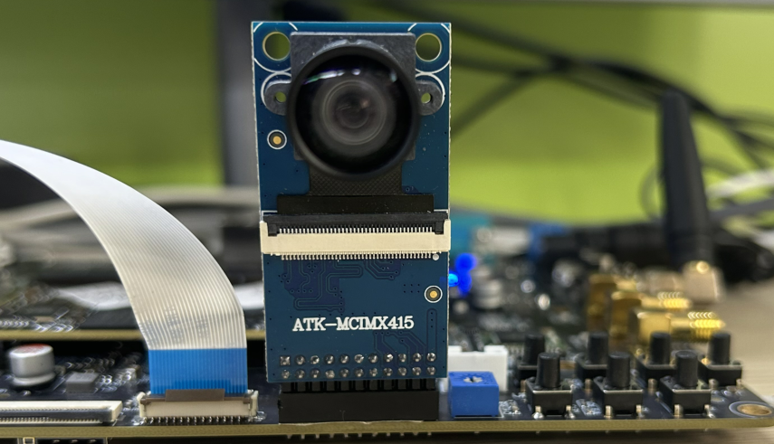

# 3.6 摄像头测试

&emsp;&emsp;ATK-DLRK3568支持MIPI CSI摄像头，正点原子为此开发板配套三款摄像头分为IMX415（800W像素）、IMX335（500W像素）和OV13850（1300W像素）。IMX415为8M像素摄像头可以录制4K(3840x2160)视频，IMX335为5M像素摄像头可以录制2K(2592x1944)视频。安装方法是摄像头镜头朝向开发板外侧，如下图所示（以imx415为例）。

<center>

</center>

&emsp;&emsp;IMX415最大支持4K（3840x2160）播放，由于正点原子的MIPI屏是720P（720*1280）分辨率或1080P（1080*1920）分辨率，数据端采集了超过屏的分辨率数据，kmssink会自动适应屏幕的大小并显示在屏幕上，但是数据还是摄像头采集的大小。

&emsp;&emsp;因为默认出厂内核配置了两路同时显示(MIPI和HDMI)，为了确保kmssink可以在你的MIPI屏显示，你需要将HDMI显示通道关闭。先执行下面指令将其它两路关闭。

```c#
echo off > /sys/class/drm/card0-HDMI-A-1/status
```

&emsp;&emsp;当然你也是可以点击出厂界面上的相机App测试摄像头，执行下面指令采集视频并显示在MIPI屏幕上。**注意：相机App与下面采集视频的指令不能同时使用。**

```c#
gst-launch-1.0 v4l2src device=/dev/video0 ! video/x-raw,format=NV12,width=3840,height=2160,\
framerate=30/1 ! kmssink
```

&emsp;&emsp;IMX335最大支持2K（2592x1944）播放，由于正点原子的MIPI屏是720P（720*1280）分辨率或1080P（1080*1920）分辨率，数据端采集了超过屏的分辨率数据，kmssink会自动适应屏幕的大小并显示在屏幕上，但是数据还是摄像头采集的大小。

&emsp;&emsp;采集视频并显示在MIPI屏幕上。

```c#
gst-launch-1.0 v4l2src device=/dev/video0 ! video/x-raw,format=NV12,width=2592,height=1944,\
framerate=30/1 ! kmssink
```