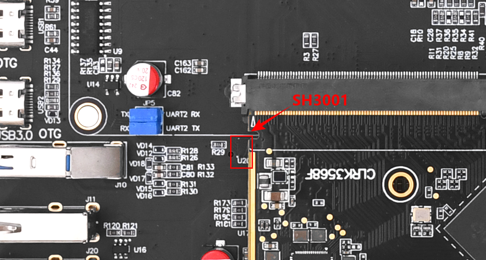
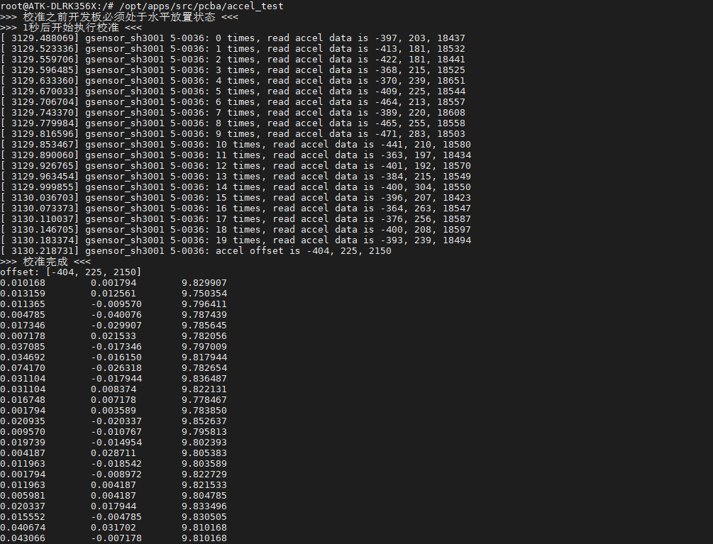
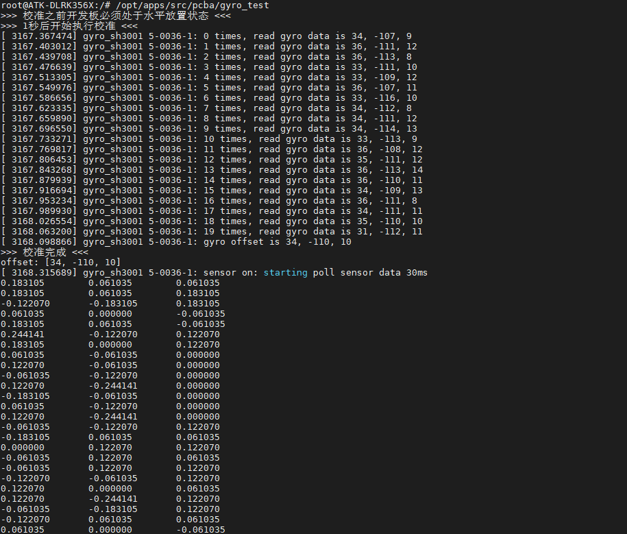

# 3.7 SH3001六轴传感器测试

&emsp;&emsp;SH3001简介：<br />
&emsp;&emsp;SH3001是一款六轴IMU(Inertial measurement unit)惯性测量单元。SH3001内部集成三轴陀螺仪以及三轴加速度计，尺寸小，功耗低，适用于消费电子市场应用，能提供高精度的实时角速度与线加速度数据。SH3001具有出色的温度稳定性，在-40℃到85℃的工作范围内能保持高分辨率。应用场景：智能手机游戏、光学防抖；智能手表、手环的姿态检测、定位导航；TWS耳机的姿态检测、3D音效；智能运动中跳绳、拉力绳、健腹轮等器械的自动计数和运动轨迹记录；智能电动牙刷、智能水杯的姿态检测；扭扭车的姿态控制；智能养殖、清扫机器人的组合导航；智能工业应用中的平台稳定、姿态测量。

&emsp;&emsp;技术参数品牌： Senodia<br />
&emsp;&emsp;型号： SH3001<br />
&emsp;&emsp;封装： 14 Pins LGA<br />
&emsp;&emsp;陀螺仪量程 262，131，65.5，32.8，16.4(LSB/°/s)<br />
&emsp;&emsp;陀螺仪灵敏度 262，131，65.5，32.8，16.4(LSB/°/s)<br />
&emsp;&emsp;加速度计量程 ±2，±4， ±8， ±16(g)<br />
&emsp;&emsp;加速度计灵敏度 16384，8192，4096，2048(LSB/g)<br />
&emsp;&emsp;最小工作温度： -40℃最大工作温度： 100℃<br />
&emsp;&emsp;最小电源电压： 3V<br />
&emsp;&emsp;最大电源电压： 8V<br />
&emsp;&emsp;尺寸 2.5×3.0×0.9mm³


<center>
<br />
图3.7.1 SH3001在开发板的位置
</center>

&emsp;&emsp;ATK-DLRK3568底板上使用I2C5接口连接了一个六轴传感器 SH3001。出厂系统已经将SH3001驱动起来了，但是需要编写C应用程序才能获取数据，程序源码位于`开发板光盘A盘-基础资料->01、程序源码->外设测试源码。`测试方法如下。可执行程序路径位于/opt/apps/src/pcba/下，pcba目录下的程序作为出厂测试程序检测硬件是否功能正常使用。

## 3.7.1 加速度测试

&emsp;&emsp;执行下面指令测试加速度。注意，需要将开发板水平放置，此程序将会开启校准，然后再获取数据。校准的数据由驱动保存到存储设备。

```c#
/opt/apps/src/pcba/accel_test
```

&emsp;&emsp;如下图，从左往右分别是xyz轴的加速度，可以摆动开发板，再看看测试出来的数据。按Ctrl +c 结束测试程序。


<center>
<br />
图3.7.1.1 读取出来的加速度数据
</center>

## 3.7.2 角速度

&emsp;&emsp;同理，执行下面的程序获取角速度数据。

```c#
/opt/apps/src/pcba/gyro_test
```

<center>
<br />
图3.7.2 读取出来的角速度数据
</center>


