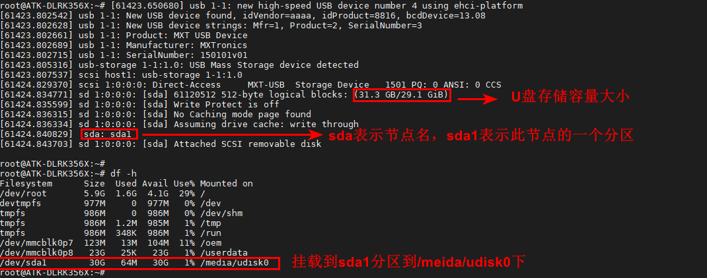
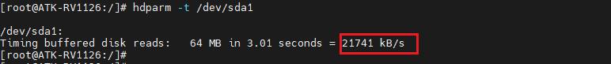
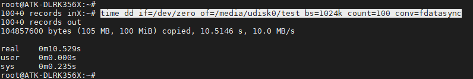
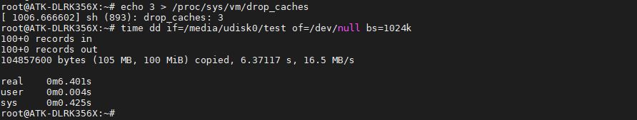
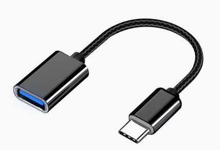

# 3.8 USB测试

## 3.8.1 USB HOST测试

&emsp;&emsp;将一张FAT32格式的U盘用读卡器，直接插在ATK-DLRK3568底板的USB接口上（3个USB接口都行，其中两个是USB2.0，蓝色接口的是USB3.0（注意：USB3.0接口与OTG是共用的，当插上OTG时，USB3.0接口不能使用。 USB3.0可以当主机或者从机，用作烧录或者外接U盘。）如下图。


<center>
<br />
图3.8.1.1 U盘挂载的信息
</center>

&emsp;&emsp;我们可以直接进入/media/usb0目录进入读写文件操作。

&emsp;&emsp;读速度测试：

```c#
hdparm -t /dev/sda1
```

<center>
<br />
图3.8.1.2 读取速度评测
</center>

&emsp;&emsp;写速度测试：

```c#
	time dd if=/dev/zero of=/media/udisk0/test bs=1024k count=100 conv=fdatasync
	rm /media/udisk0/test
```

&emsp;&emsp;这里代表写入100MiB的文件，写入速度为14.5 MB/s。实际上写入的文件越大求平均写入速度越接近实际值。

### 3.8.1.1 USB2.0测试

&emsp;&emsp;注意：测试读写速度与个人读卡器或U盘/TF卡的最大读写速度有关。

&emsp;&emsp;使用hdparm指令读速度测试，这里3.05s读取了47MB，速度可能不太准确，因为采样太小。

```c#
hdparm -t /dev/sda1
```

<center>

</center>

&emsp;&emsp;写速度测试：

```c#
	time dd if=/dev/zero of=/media/udisk0/test bs=1024k count=100 conv=fdatasync	#注意指令过长，导致指令显示异常，但不影响操作。
```

<center>

</center>

&emsp;&emsp;使用dd指令读，因为 Linux系统机制，一般情况下不需要特意去释放已经使用的 cache。这些 cache 内容可以增加文件的读写速度。

&emsp;&emsp;执行下面指令清除缓存。

```c#
echo 3 > /proc/sys/vm/drop_caches                    #清除缓存
time dd if=/media/udisk0/test of=/dev/null bs=1024k  #读取速度测试
rm /media/udisk0/test                                #读完将此文件删除
```

<center>

</center>

### 3.8.1.2 USB3.0测试

&emsp;&emsp;在前面说过，OTG与USB3.0接口是共用的关系，当我们要使用USB3.0接口当主机时，OTG就不要接连接线。

&emsp;&emsp;同理，测试方法与3.8.1.1测试步骤一样。注意：读写速度与U盘速度最大有关。

## 3.8.2 OTG从机测试

&emsp;&emsp;ATK-DLRK3568底板上OTG接口，可当作ADB使用，我们使用一根USB Type-C连接线连接OTG接口到PC(电脑)。使用adb指令就可以与开发板通信了。

## 3.8.3 OTG主机测试

&emsp;&emsp;使用USB转Tpye-C连接线（若用户手上没有此连接线可不做此实验）接上U盘，插到OTG接口处，和3.8.1.1小节一样测试即可。

&emsp;&emsp;USB转Tpye-C连接线如下，此连接线请自行按需购买。


<center>

</center>


