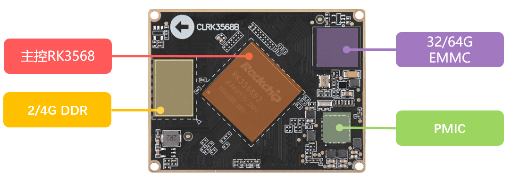
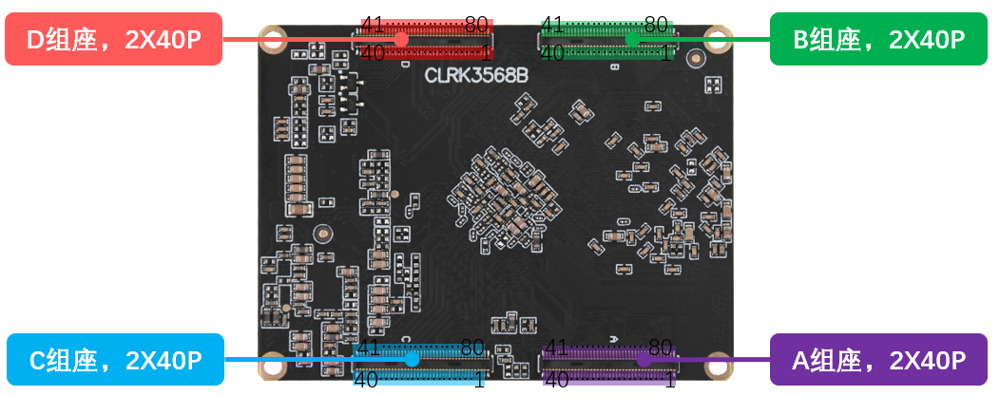

# 2.1 核心板硬件参数

|   **参数项**   |                 **参数**                  | **备注**                                                     |
| :------------: | :---------------------------------------: | :----------------------------------------------------------- |
|    尺寸规格    |                 60mm*45mm                 | 长*宽                                                        |
|      CPU       |              Rockchip RK3568              | BGA636封装                                                   |
|      内存      |               2/4GB LPDDR4                | 贴片封装。受芯片供货影响，可能会有多种不同厂家的芯片，一切以实际贴片的型号为准。 |
|      存储      |                  32/64G                   | 贴片封装。受芯片供货影响，可能会有多种不同厂家的芯片，一切以实际贴片的型号为准。 |
|  电源管理芯片  |                   RK809                   |                                                              |
| 工作电压（1）  |          两路电压输入3.3V和5.0V           |                                                              |
|    功耗(2)     |                   ≥2.0W                   | 静态功耗，具体功耗取决于外设                                 |
|    运行温度    | 商业级0℃ ～ +70℃ 工业级 -40℃ ～ +85℃ | RK3568B2为商业级，RK3568J为工业级，二者兼容，一下统称RK3568  |
|     引脚数     |                  320Pin                   |                                                              |
|    引脚间距    |                   0.4mm                   | 核心板引脚中心间距                                           |
| 核心板连接方式 |                    BTB                    | 连接器：DF40C-80DS-04V，公座                                 |
|    PCB工艺     |      10层，沉金工艺，独立接地信号层       | 采用无铅工艺                                                 |

&emsp;&emsp;注：（1）核心板的工作电压分别是由一路3.3V和一路5.0V输入的，具体可以参考RK3568核心板原理图。

&emsp;&emsp;（2）核心板的功耗数据是由环境12V/2.5A输入，只接串口UART2，不接其他外设。具体功耗数据取决于开发板所接的外设。

 
图 2.1.1 核心板正面资源

 
图 2.1.2核心板背面资源

