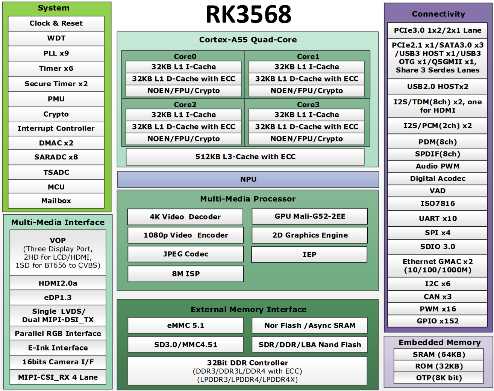

# 2.2 RK3568芯片参数

 
图 2.2.1 芯片资源

&emsp;&emsp;具体细节参数可以参考RK3568芯片数据手册。

&emsp;&emsp;**RK3568主控芯片资源**

|    处理器    | 四核Cortex-A55，2.0GHz                                       | GPU            | Mali G52                                                     |
| :----------: | :----------------------------------------------------------- | -------------- | ------------------------------------------------------------ |
|     NPU      | 1.0 TOPS                                                     | RGA 2D图像引擎 | 2D图像裁剪、格式转换、缩放、旋转、图片叠加等                 |
|  视频编码器  | 1080P@60fpsH.265/H.264                                       | 视频解码器     | 4k@60fps H.265/H.264/VP9                                     |
|  JPEG解码器  | 最大支持8176x8176 每秒 7600 万像素                      | JPEG编码器     | 最大支持8192x8192 高达每秒 9000 万像素                  |
| MIPI CSI RX  | 1x4-lane/2x2-lane@2.5Gbps/lane                               | DVP            | 8/10/12/16 bits 最高支持 150MHz                         |
|     ISP      | 支持3A、HDR、3DLUT、BLC等                                    | VICAP          | 支持BT.656/601/1120等                                        |
|  RGB/BT1120  | 支持1080P@60fps 支持RGB格式 （最高8bit）； 高达150MHz的数据速率 | MIPI DSI TX    | 支持2个通道的DSI，每个通道支持4个数据通道；最高支持2.5Gbps/lane。 单MIPI模式支持1080P@60Hz显示； 双MIPI模式支持1440P@60Hz显示； 支持RGB格式（最高8bit） |
|    BT656     | 支持PAL和NTSC                                                | LVDS           | 支持RGB888和RGB666输入； 支持VESA/JEIDA数据格式输入     |
|   HDMI TX    | 高达10 bits深颜色模式 1080P@120Hz和4K@60Hz，支持3D视频格式、RGB/YUV（最高10bit）格式、HDCP1.4/2.2 | EDP            | 最多4条物理通道，高达2.7Gbps/lane；支持PSR、2K@60Hz、RGB格式（最高10bit） |
|     EBC      | 兼容EPD，支持2200*1650、16bit数据、16级灰度、每次扫描最大256帧 | USB 2.0 HOST   | × 2，支持高速(480Mbps)、全速(12Mbps)和低速(1.5Mbps)模式      |
| SD3.0/MMC4.5 | × 1，数据总线宽度为4 bits                                    | SDIO3.0        | 4 bits 数据总线宽度                                          |
|     UART     | × 10，5/6/7/8位，波特率最高支持4Mbps                         | Ethernet       | × 2，10/100/1000M RGMII 10/100 RMII                     |
|     PWM      | × 16，支持连续模式或单次模式                                 | Timer          | × 6，64 bits 非安全应用程序                             |
|     PDM      | × 8，采样率高达192KHz 支持PDM主接收模式                 | I2S            | × 8 采样率高达192KHz 音频分辨率16～32位            |
|     SPI      | × 4，32 bits支持 一次chip-select输出，支持两次chip-select输出 | I2C            | × 6，支持7bit和10bit地址模式 数据传输速率支持100Kbit/s、400Kbit/s、1Mbit/s |
|     GPIO     | × 152，具有复用功能                                          | 封装           | FCCSP636L                                                    |

&emsp;&emsp;注意：这里是芯片数据手册资源参数值，非核心板可用资源参数值。

