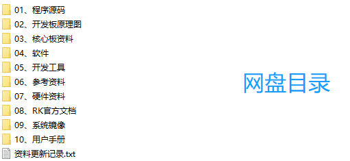

# 6 开发资料

&emsp;&emsp;开发资料下载：http://www.openedv.com/docs/boards/arm-linux/index.html 

&emsp;&emsp;开发资料基于ATK-DLRK3568开发板编写，请使用开发板进行项目调研和测试。

&emsp;&emsp;开发板资料目录：

 
图 6.1 开发板资料目录

&emsp;&emsp;核心板资料基于ATK-CLRK3568F核心板编写，从ATK-DLRK3568开发板资料中提取出来，方便用户单独下载使用。

&emsp;&emsp;核心板资料目录：

 
图 6.2 核心板资料目录

