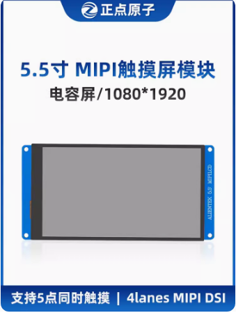
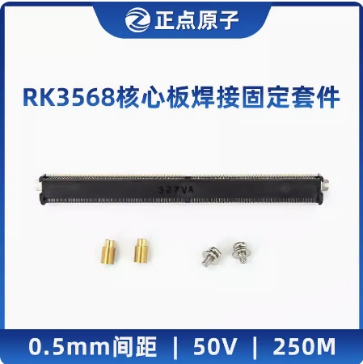

# 7.2  模块配件

&emsp;&emsp;【MIPI屏】正点原子5.5寸MIPI LCD模块电容触摸液晶显示720*1280

&emsp;&emsp;购买链接：
https://detail.tmall.com/item.htm?id=691859000787&spm=a8919.3000000002019401.0.1

 
图 7.2.1 ATK-MD0550-720*1280屏幕

&emsp;&emsp;【MIPI屏】正点原子5.5寸MIPI LCD模块电容触摸液晶显示1080*1920

&emsp;&emsp;购买链接：
https://detail.tmall.com/item.htm?abbucket=13&id=695359786795&rn=34493d97372125c81b029624161ac168&spm=a1z10.5-b-s.w4011-24686329149.111.5a4248f5mk6CdZ 

 
图 7.2.2 ATK-MD0550-1080*1920屏幕

&emsp;&emsp;正点原子MIPI摄像头模块ATK-MCIMX335 500W像素2K分辨率2592*1944。

&emsp;&emsp;购买链接：
https://detail.tmall.com/item.htm?id=692717223426&spm=a8919.3000000002019401.0.1

 
图 7.2.3 ATK-MCIMX335摄像头

&emsp;&emsp;正点原子MIPI摄像头模块ATK-MCIMX415 800W像素4K分辨率3840*2160。

&emsp;&emsp;购买链接：
https://detail.tmall.com/item.htm?id=691858740586&spm=a8919.3000000002019401.0.1

 
图 7.2.4 MCIMX415摄像头

&emsp;&emsp;正点原子USB串口转换器三合一工业级模块232 485 TTL RS232 RS485

&emsp;&emsp;购买链接：
https://detail.tmall.com/item.htm?id=609294825344&spm=a8919.3000000002019401.0.1

 
图 7.2.5 USB串口转换器

&emsp;&emsp;正点原子RK3568核心板焊接固定套件（7.8H座,铜柱X2,螺丝X2）

&emsp;&emsp;购买链接:
https://detail.tmall.com/item.htm?id=732353699122&spm=a8919.3000000002019401.0.1

 
图 7.2.6 核心板固定套件

&emsp;&emsp;正点原子RK3568开发板散热套件

&emsp;&emsp;购买链接:
https://detail.tmall.com/item.htm?id=731870580610&spm=a8919.3000000002019401.0.1

 
图 7.2.7 核心板固定套件

