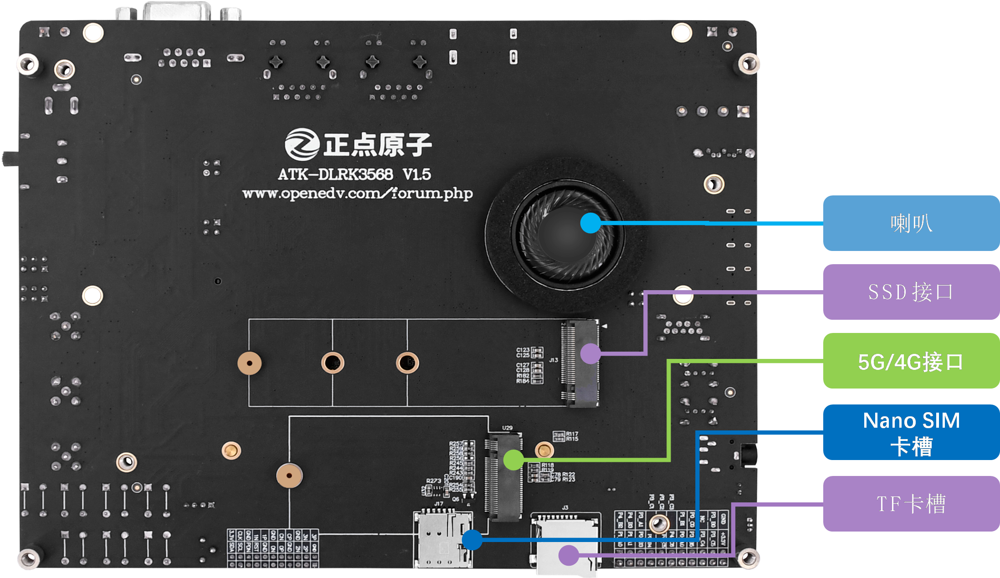

# 1.1 ATK-DLRK3568开发板底板资源

&emsp;&emsp;首先，我们来一下ATK-DLRK3568开发板的底板正反面资源图，如图1.1.1所示：

 
图1.1.1 ATK-DLRK3568开发板底板正面资源图

 
图1.1.2 ATK-DLRK3568开发板底板反面资源图

&emsp;&emsp;从上面两幅图可以看出，ATK-DLRK3568开发板底板资源十分丰富，把RK3568的内部资源发挥到了极致，基本上RK3568内部大部分的资源都可以在此开发板上验证，同时扩充丰富的接口和功能模块，整个开发板显得十分大气。

&emsp;&emsp;开发板的外形尺寸为180mm*140mm大小，板子的设计充分考虑了人性化设计，并结合正点原子多年的开发板设计经验，经过多次 改进，最终确定了这样的设计。

&emsp;&emsp;根据图1.1.1和图1.1.2所示，正点原子ATK-DLRK3568开发板底板板载资源如下： 
&emsp;&emsp;◆	底板采用4层沉金设计 
&emsp;&emsp;◆	1个核心板接口，支持RK3568核心板 
&emsp;&emsp;◆	1个电源开关，控制整个板的电源  
&emsp;&emsp;◆	1个12V直流电源输入接口 
&emsp;&emsp;◆	1个RS485接口 
&emsp;&emsp;◆	1个RS232接口 
&emsp;&emsp;◆	2个10/100/1000M网络接口 
&emsp;&emsp;◆	1个HDMI输出接口，可以接HDMI显示器 
&emsp;&emsp;◆	1个EDP屏幕接口，可以接EDP屏幕 
&emsp;&emsp;◆	1个CAN接口，支持CAN FD功能 
&emsp;&emsp;◆	1个SATA电源接口 
&emsp;&emsp;◆	1个SATA机械硬盘接口 
&emsp;&emsp;◆	1个USB串口，可用于代码调试，Type-C接口类型 
&emsp;&emsp;◆	1个USB OTG3.0接口，可进行USB从机通信，主要用于固件烧写，Type-C接口类型 
&emsp;&emsp;◆	1个六轴传感器，三轴陀螺仪，三轴加速度计 
&emsp;&emsp;◆	1个USB3.0 HOST接口 
&emsp;&emsp;◆	2个USB2.0 HOST接口 
&emsp;&emsp;◆	1个耳机接口 
&emsp;&emsp;◆	1个录音头（MIC/咪头） 
&emsp;&emsp;◆	1个红外接收头，可以进行红外遥控器测试 
&emsp;&emsp;◆	1个光环境传感器（光照、距离、红外三合一） 
&emsp;&emsp;◆	1个2×11P，2.54mm间距的排针，引出19个IO(SPI、I2C、UART和GPIO)，用户可自行使用 
&emsp;&emsp;◆	1个RTC纽扣电池座，并带电池 
&emsp;&emsp;◆	1个RTC芯片，采用AT8563或PCF8563芯片，以实际焊接芯片型号为准 
&emsp;&emsp;◆	1个LVDS屏幕接口 
&emsp;&emsp;◆	1个MIPI DSI屏幕接口，4 lanes 
&emsp;&emsp;◆	1个MIPI CSI摄像头接口，4 lanes 
&emsp;&emsp;◆	1个可调电位器，用于ADC测试 
&emsp;&emsp;◆	1个4P的散热风扇接口 
&emsp;&emsp;◆	3个功能按键，用于系统烧写控制，复位等功能。 
&emsp;&emsp;◆	4个用户按键，用户可自行使用 
&emsp;&emsp;◆	1个状态指示灯（绿色，用户可以使用） 
&emsp;&emsp;◆	2个WIFI天线接口 
&emsp;&emsp;◆	1个BT天线接口 
&emsp;&emsp;◆	1个SDIO WIFI&BT模块，板载 
&emsp;&emsp;◆	1组5V电源供应/接入口 
&emsp;&emsp;◆	1组3.3V电源供应/接入口 
&emsp;&emsp;◆	1个电源指示灯（蓝色） 
&emsp;&emsp;◆	1个小扬声器（在板子背面） 
&emsp;&emsp;◆	1个M.2接口的SSD接口，可以连接SSD固态硬盘 
&emsp;&emsp;◆	1个M.2接口的SSD接口，可以连接 SSD固态硬盘 
&emsp;&emsp;◆	1个5G/4G模组接口 
&emsp;&emsp;◆	1个Nano SIM卡接口 
&emsp;&emsp;◆	1个TF卡接口

&emsp;&emsp;正点原子ATK-DLRK3568开发板底板的特点包括： 
&emsp;&emsp;1)、接口丰富。板子提供多种标准接口，可以方便的进行各种外设的实验和开发。 
&emsp;&emsp;2)、设计灵活。我们采用核心板+底板形式，板上很多资源都可以灵活配置，以满足不同条件下的使用。  
&emsp;&emsp;3)、资源丰富，音频编解码、六轴传感器、千兆网卡以及各种接口芯片，满足各种应用需求。 
&emsp;&emsp;4)、人性化设计。各个接口都有丝印标注，且用方框框出，使用起来一目了然；部分常用外设大丝印标出，方便查找；接口位置设计合理，方便顺手。资源搭配合理，物尽其用。

