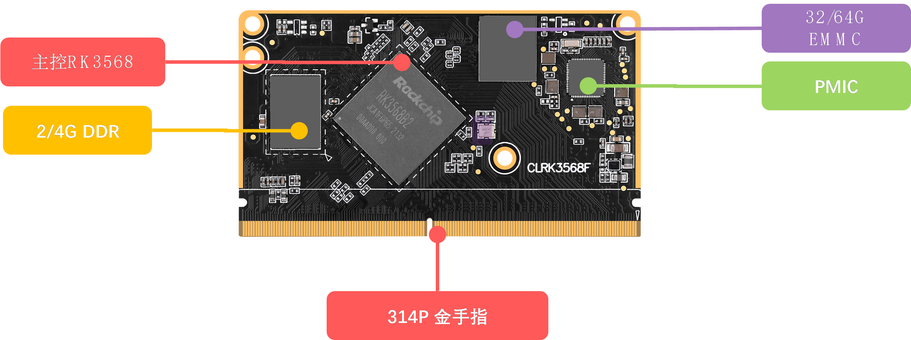

# 1.2 ATK-CLRK3568F核心板资源

&emsp;&emsp;ATK-DLRK3568开发板所使用的核心板型号为ATK-CLRK3568F。接下来，我们来看ATK-CLRK3568F核心板资源图，如图1.2.1所示：

 
图1.2.1 ATK-CLRK3568F核心板资源图

&emsp;&emsp;从图1.2.1可以看出，ATK-CLRK3568核心板板载资源丰富，可以满足各种应用的需求。整个核心板的外形尺寸为82mm*46mm大小，并且采用了314P 金手指接口，使得其可以很方便的应用在各种项目上。

&emsp;&emsp;正点原子ATK-CLRK3568F核心板板载资源如下： 
&emsp;&emsp;◆	核心板采用10层沉金设计。 
&emsp;&emsp;◆	CPU：采用瑞芯微RK3568主控，4核Cortex-A55，主频高达2.0GHz。内置H264/H265硬件编解码，支持4K@60fps解码，1080P@60fps编码，支持高质量的JPEG编解码。内置3D GPU(Mali-G52),支持OpenGL ES1.1/2.0/3.2、OpenCL2.0和Vulkan 1.1。另外内置1.0TOPs NPU，支持INT8和INT16。内置8M ISP，支持多屏异显。 
&emsp;&emsp;◆	外扩1片LPDDR4/LPDDR4X，内存容量为2GB/4GB可选，位宽32位。 
&emsp;&emsp;◆	32/64GB EMMC存储芯片。 
&emsp;&emsp;◆	314P金手指接口， 共引出127个GPIO(可复用为其他功能)、105个其他功能引脚(HDMI、EDP、USB、MIPI屏幕，MIPI摄像头、ADC、音频等)、14个电源引脚(给核心板供电引脚以及核心板PMIC输出电源引脚，不包含GND)。

&emsp;&emsp;正点原子ATK-CLRK3568F核心板的特点包括： 
&emsp;&emsp;1)、体积小巧。核心板仅82mm*64mm大小，方便使用到各种项目里面。 
&emsp;&emsp;2)、集成方便。核心板使用314P 金手指接口，可以非常方便的集成到客户PCB上，更换简单，方便维修测试。 
&emsp;&emsp;3)、资源丰富。核心板板载：2GB/4GB LDDR4/4X内存、8GB EMMC存储器，可以满足各种应用需求。 
&emsp;&emsp;4)、性能稳定。核心板采用10层板沉金设计，单独地层、电源层，且关键信号采用等长线走线，阻抗匹配，保证运行稳定、可靠。 
&emsp;&emsp;5)、人性化设计。底部放有详细丝印，方便安装；按功能分区引出IO口，方便布线。

