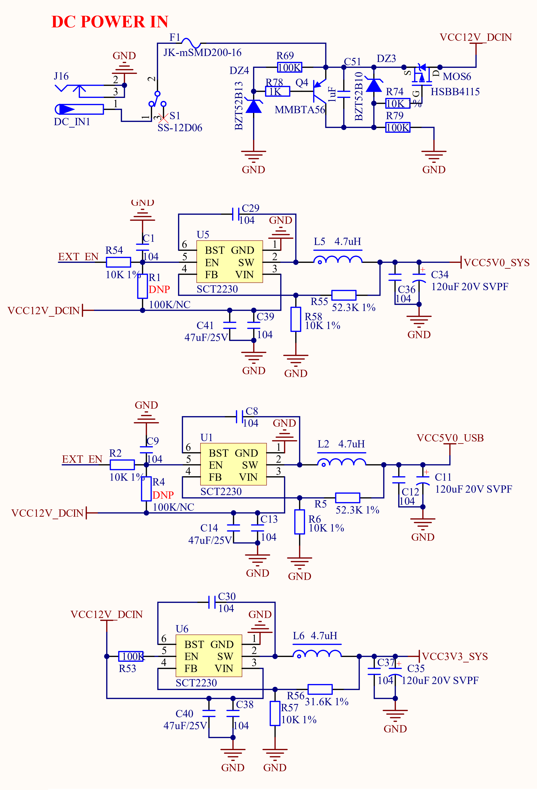

# 3.1 电源	

&emsp;&emsp;ATK-DLRK3568开发板板载的电源供电部分，其原理图如图3.1.1所示：

 
图3.1.1 电源

&emsp;&emsp;图中，总输入电源电压为12V，总共有3个稳压芯片：U1/U5/U6，DC_IN1用于外部12V直流电源输入，建议使用正点原子开发板配套的12V电源。经过U6 DC-DC芯片转换为3.3V电源输出， U5芯片转换为5.0V电源输出，U1芯片转换为5.0V USB电源输出。S1为开发板的总电源开关。

