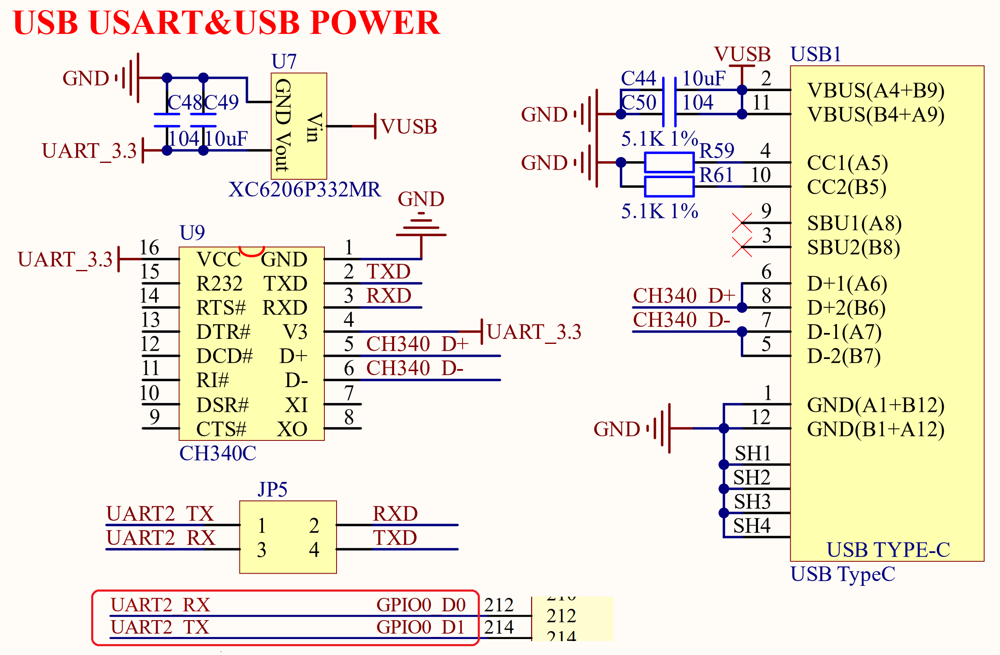

# 3.10 调试串口(Type-C) 

&emsp;&emsp;正点原子ATK-DLRK3568开发板板载了一个USB串口，其原理图如图3.10.1所示：

 
图3.10.1 USB串口

&emsp;&emsp;图3.10.1中U9这颗芯片就是USB转串口芯片，型号为CH340C，是国内芯片公司南京沁恒的产品，稳定性非常不错所以还是多支持下国产。CH340C内置晶振，因此就不需要再在外面连接一个晶振。

&emsp;&emsp;图中可以看出CH340C的电源为3.3V，并且是独立供电的，U7是一个LDO芯片，负责给CH340C提供3.3V的电源。CH340C的电源不受开发板电源开关控制，只要接上USB线CH340就会上电。图中CH340C的RXD/TXD接JP5的RXD/TXD，这个是CH340芯片的串口接收和发送脚，JP5可以通过跳线帽将CH340C的串口引脚连接到RK3568的串口2上。

&emsp;&emsp;右侧的USB1是一个USB Type-C座，提供CH340C和电脑通信的接口，注意，此接口只能做串口功能，不能给开发板供电，开发板必须使用配套的12V电源！

