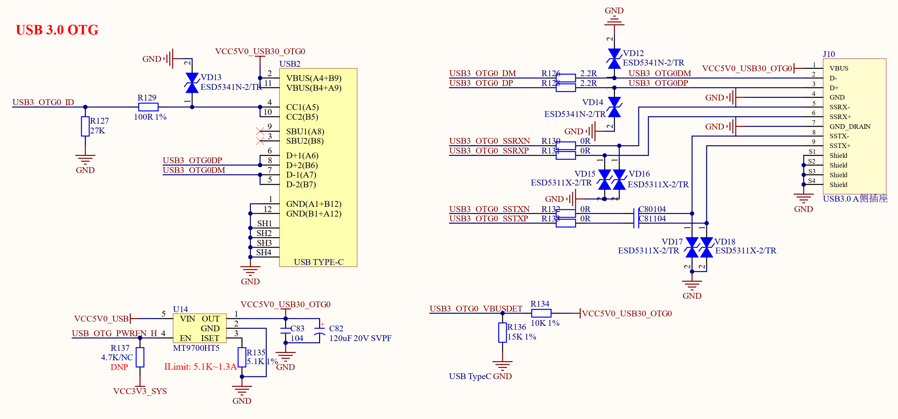

# 3.11 USB OTG(Type-C)接口

&emsp;&emsp;正点原子ATK-DLRK3568开发板也有一路USB OTG接口，连接到了RK3568的USB OTG接口上，USB OTG接口如图3.11.1所示：

 
图3.11.1 USB OTG接口

&emsp;&emsp;USB OTG既可以做从机，也可以做主机，ATK-DLRK3568开发板的USB OTG电路同时给出了Type-C从机接口和USB HOST主机接口，方便大家进行USB 3.0 OTG的主从机测试。

&emsp;&emsp;图3.11.1中的USB2就是开发板的USB OTG从机接口，为USB Type-C类型，此接口做从机测试，一般用于烧写系统。J10是USB HOST接口，用于做主机测试。注意，这两个接口同时只能接一个！因为他们是同一个USB3.0 OTG口，这里只是为了方便大家使用，搞了两个接口出来。

