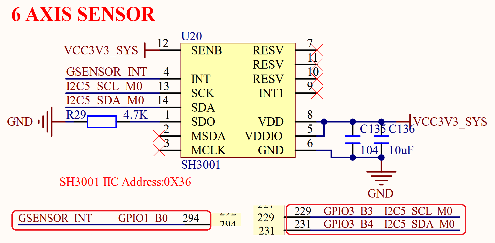

# 3.12 六轴传感器

&emsp;&emsp;ATK-DLRK3568开发板板载了一个六轴传感器，电路如图3.12.1所示：

 
图3.12.1 六轴传感器

&emsp;&emsp;六轴传感器芯片型号为：SH3001，该芯片内部集成了：三轴加速度传感器和三轴陀螺仪，这里我们使用I2C接口来访问。使用RK3568的I2C5来连接SH3001，I2C5_SCL_M0和I2C5_SDA_M0分别连接到RK3568的GPIO3_B3和GPIO3_B4这两个引脚。GSENSOR_INT是SH3001的中断引脚，连接到RK3568的GPIO1_B0引脚上。

