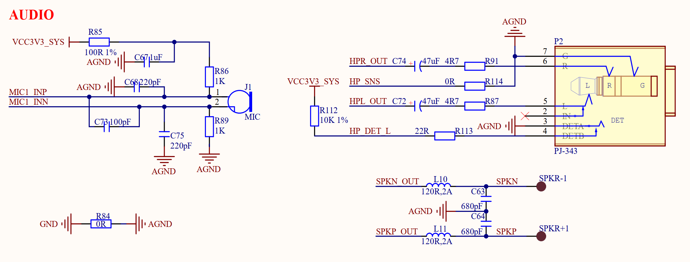

# 3.14 音频接口

&emsp;&emsp;音频接口包括板载MIC、耳机以及背面喇叭，原理图如图3.14.1所示：

 
图3.14.1 音频原理图

&emsp;&emsp;ATK-CLRK3568F核心板上的RK809这颗PMIC集成了音频编解码器，所以我们的开发板底板上就不需要额外的音频编解码芯片。图3.14.1中MIC就是板载咪头，用于录音，MIC1_INP和MIC1_INN这两个引脚连接到了RK809的43(MIC1p)和42(MIC1n)这两个引脚上。

&emsp;&emsp;图3.14.1中SPKN和SPKP连接到开发板背面的喇叭上，其中SPKN_OUT和SPKP_OUT连接到RK809的34(SPK_OUTn)和32(SPK_OUTp)引脚上。

&emsp;&emsp;图3.14.1中P2是耳机座，可以通过耳机座连接耳机，HPL_OUT、HPR_OUT和HP_SNS连接到RK809的39(HPL_OUT)、41(HPR_OUT)和40(HP_SNS)引脚上。HP_DET_L用于检测耳机是否插入，连接到了RK3568的GPIO1_A4引脚上。

