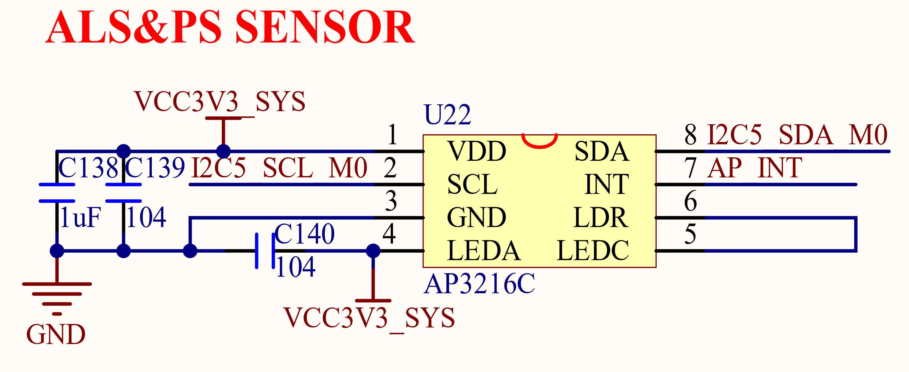

# 3.16 光环境传感器

&emsp;&emsp;ATK-DLRK3568开发板板载了一个光环境传感器，可以用来感应周围光线强度、接近距离和红外线强度等，该部分电路如图1.3.13.1所示：

 
图3.16.1 光环境传感器电路

&emsp;&emsp;图中的U22就是光环境传感器：AP3216C，它集成了光照强度、近距离、红外三个传感器功能于一身 ，被广泛应用于各种智能手机。该芯片采用IIC接口，连接在RK3568的I2C5接口上，I2C5_SCL_M0和I2C5_SDA_M0分别连接在GPIO3_B3和GPIO3_B4上，AP_INT是其中断输出脚，连接在RK3568的GPIO4_D2上。

