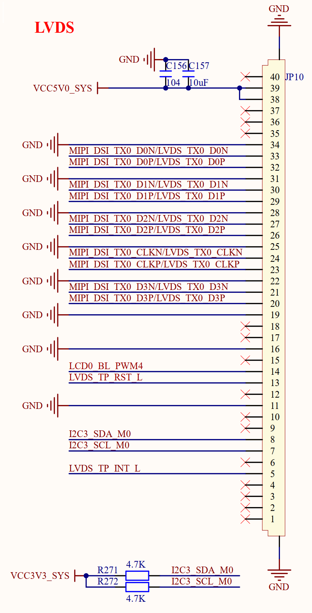

# 3.19 LVDS屏接口

&emsp;&emsp;ATK-DLRK3568开发板有一个LVDS屏幕接口，原理图如图3.19.1所示：

 
图3.19.1 LVDS屏幕接口

&emsp;&emsp;图3.19.1中JP10就是LVDS屏幕接口，为0.5mm 40P的FPC座。正点原子有一款10.1寸RGB&LVDS双接口屏幕，默认是RGB接口的，需要修改电阻改成LVDS接口的，大家如果要测试LVDS屏幕，可以使用正点原子这款10.1寸屏幕，具体修改方式参考屏幕的手册即可。
