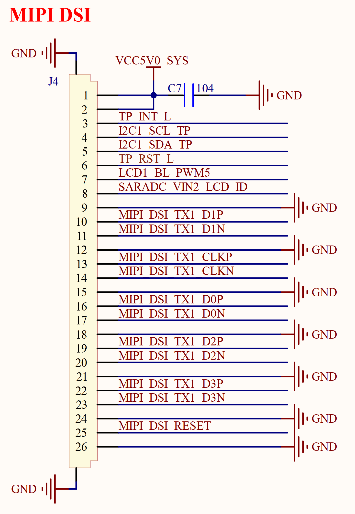

# 3.20 MIPI屏接口

&emsp;&emsp;ATK-DLRK3568开发板有一个MIPI屏幕接口，原理图如图3.20.1所示：

 
图3.20.1 MIPI屏幕接口

&emsp;&emsp;图3.20.1中，J4就是MIPI 屏幕接口，为26P 0.5mm FPC座，采用4 Lanes格式，并支持电容触摸屏。该接口仅支持MIPI接口的液晶，目前正点原子的MIPI接口屏幕模块有：5.5寸720P(1280*720)以及5.5寸1080P(1920*1080)两种。

&emsp;&emsp;图中的I2C1_SCL_TP和I2C1_SDA_TP为I2C1的两根数据线，分别连接到RK3568的GPIO0_B3和GPIO0_B4这两个IO上。LCD1_BL_PWM5是LCD的背光控制IO，连接在RK3568的GPIO0_C4上，用于控制LCD的背光。TP_RST_L是触摸屏的复位信号，连接到RK3568的GPIO0_B6引脚上。MIPI_DSI_RESET是MIPI屏幕的复位引脚，连接到RK3568的GPIO4_B5引脚上。

&emsp;&emsp;注意，图中MIPI部分的引脚工作电压为1.8V，触摸屏相关引脚工作电压为3.3V，背光引脚工作电压为3.3V。

