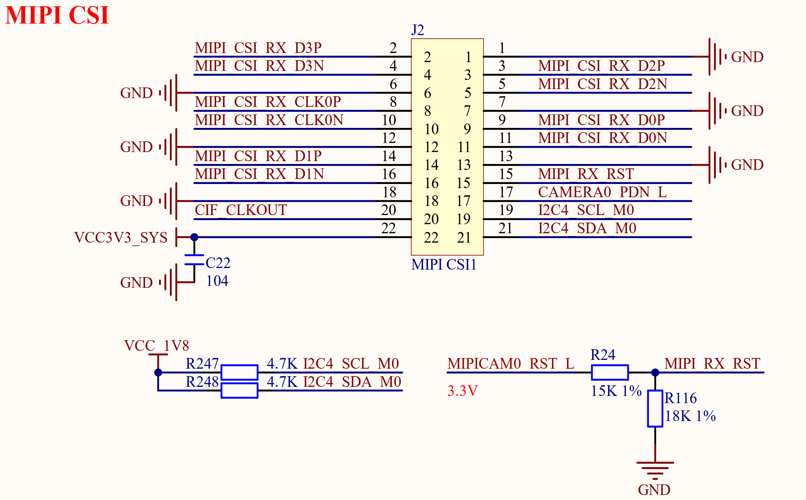

# 3.21 MIPI摄像头接口 

&emsp;&emsp;正点原子ATK-DLRK3568开发板板载板载了1个MIPI摄像头接口，其原理图如图3.21.1所示：

 
图3.21.1 摄像头模块接口

&emsp;&emsp;图中J2是MIPI摄像头接口，为2*11P 2.0mm的排座，可以用来连接正点原子MIPI摄像头模块，支持4 Lanes。注意，这个MIPI摄像头模块虽然是3.3V供电的，但是所有信号引脚电压是1.8V的，如果要使用自己的MIPI摄像头，一定要注意摄像头模块的引脚电压要为1.8V。

