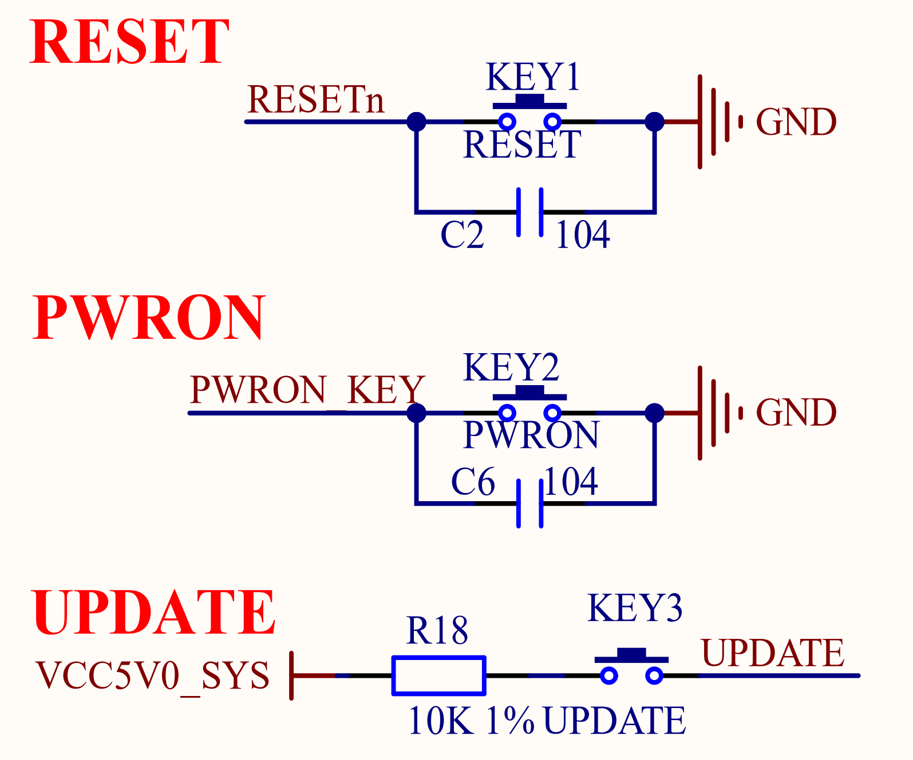

# 3.25 功能按键  

&emsp;&emsp;正点原子ATK-DLRK3568开发板板载3个功能按键，其原理图如图3.25.1所示：

 
图3.25.1 功能按键

&emsp;&emsp;从图3.25.1可以看出，一共有3个功能按键：RESET、PWRON和UPDATE。RESET是复位按键，低电平复位，当RESET按键按下以后会复位整个开发板。PWRON按键是核心板上RK809这个PMIC的PWRON按键，如果核心板不正常插拔以后供电可能出问题，即使按RESET按键进行复位也不能解决，这个时候就可以按下PWRON按键。UPDATE按键用于系统升级、更新使用。
