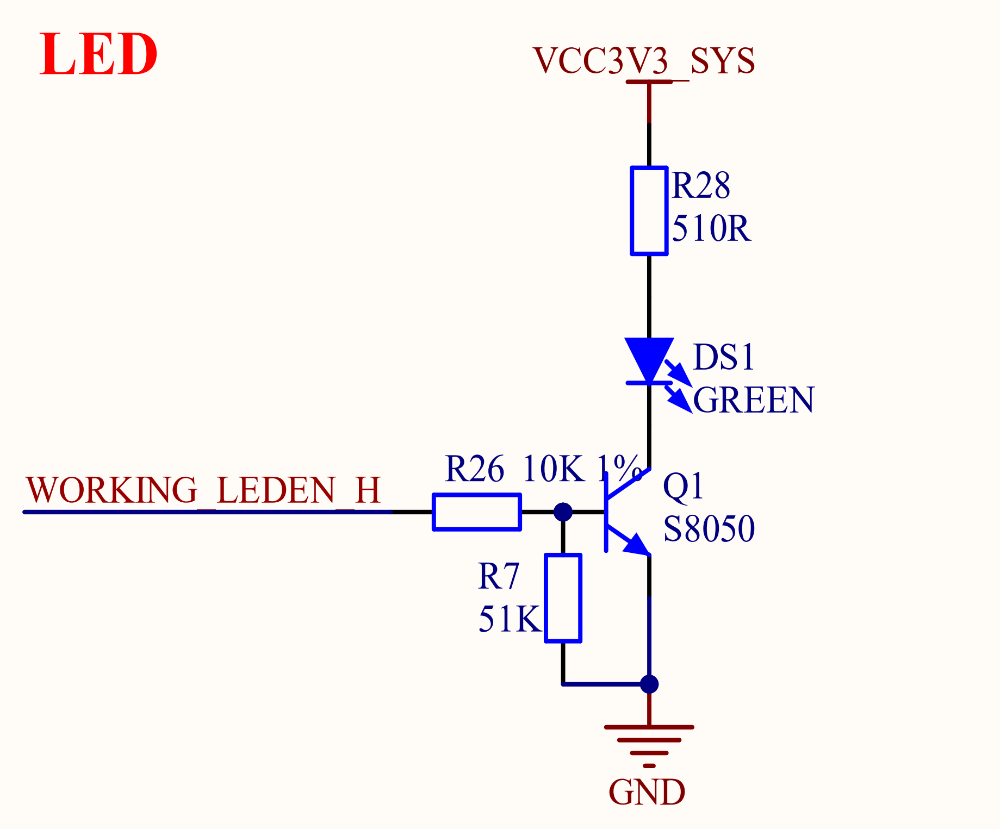

# 3.26 用户LED灯   

&emsp;&emsp;正点原子ATK-DLRK3568开发板板载1个用户LED，其原理图如图3.26.1所示：

 
图3.26.1 用户LED灯

&emsp;&emsp;图中DS1是用户LED灯，颜色为绿色，通过RK3568的GPIO0_C0这个上GPIO控制LED灯的亮灭。其中Q1这个三极管的主要目的是实现控制引脚的电平匹配，这样不管是1.8V还是3.3V的IO都可以控制LED灯亮灭。
