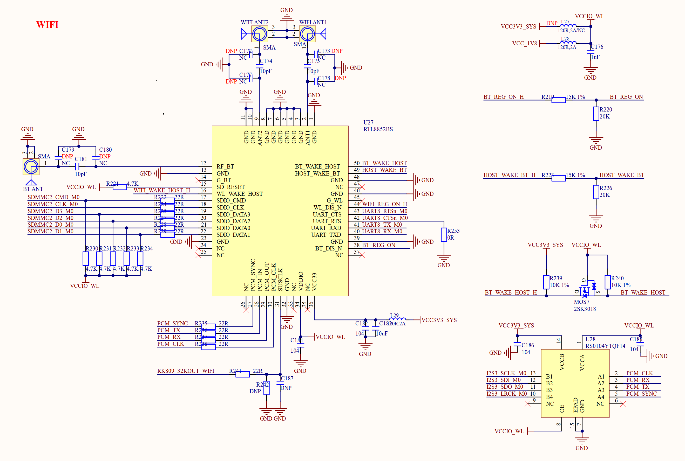

# 3.27 SDIO WIFI&蓝牙模块 

&emsp;&emsp;正点原子ATK-DLRK3568开发板板载一个SDIO WIFI&蓝牙模块，如图3.27.1所示：

 
图3.27.1 SDIO WIFI&蓝牙接口

&emsp;&emsp;WIFI&蓝模块使用RTL8852BS，这是一个SDIO接口的WIFI&蓝牙模块，是一个双频WIFI，支持WIFI6。连接到了RK3568的SDMMC2接口上，SDMMC2_D0~D3/CMD/CLK分别连接到了RK3568的GPIO3_C6/C7/D0/D1、GPIO3_D2和GPIO3_D3引脚上。

&emsp;&emsp;蓝牙部分使用到了串口，模块的UART_TXD/UART_RXD/UART_RTS/UART_CTS连接到了RK3568的UART8串口上，对应的引脚为GPIO2_C6/GPIO2_C5/GPIO2_B2/GPIO2_B1。

&emsp;&emsp;BT_WAKE_HOST/HOST_WAKE_BT/BT_REG_ON/WIFI_REG_ON_H/WIFI_WAKE_HOST_H这5个IO连接到了RK3568的GPIO0_B7/GPIO3_A2/GPIO3_A0/GPIO3_D5/GPIO3_D4这5个引脚上。

&emsp;&emsp;模块的PCM部分的PCM_RX/PCM_CLK/PCM_TX/PCM_SYNC这4个IO连接到了RK3568的GPIO3_A6/GPIO3_A3/GPIO3_A5/GPIO3_A4这4个引脚上。

&emsp;&emsp;图3.27.1中的WIFI_ANT1和WIFI_ANT2为两个WIFI天线接口，需要使用支持5G的双频WIFI天线。BT_ANT是蓝牙天线接口，一共3个天线。
