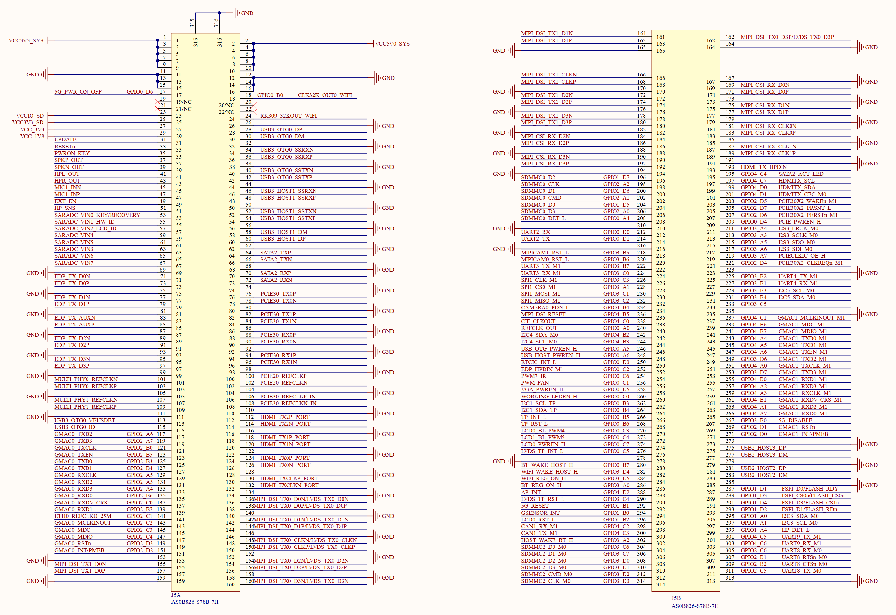

# 3.28 ATK-CLRK3568F核心板接口 

&emsp;&emsp;正点原子ATK-DLRK3568开发板采用底板+核心板的形式，开发板底板采用314P金手指座来连接核心板，接插非常方便，底板上面的核心板接口原理图如图3.28.1所示：

 
图3.28.1 底板核心板接口部分原理图

&emsp;&emsp;由于314P金手指插座太长了，所以在原理图里面分成了两部分：J5A和J5B，总计是314个引脚。在使用的时候将核心板插到金手指插座上即可。