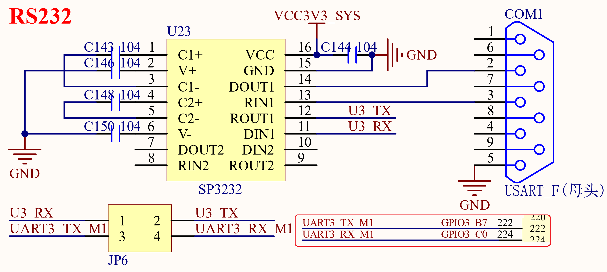

# 3.3 RS232串口

&emsp;&emsp;RK3568开发板板载了1个RS232接口，为母头，电路原理图如图3.3.1所示：

 
图3.3.1 RS232串口

&emsp;&emsp;因为RS232电平不能直接连接到RK3568，所以需要一个电平转换芯片。这里我们选择的是SP3232（也可以用MAX3232）来做电平转接。在使用的时候需要将JP6跳线帽接起来，U3_RX接UART3_TX_M1，U3_TX接UART3_RX_M1，所以RS232串口使用的是RK3568的串口3。

