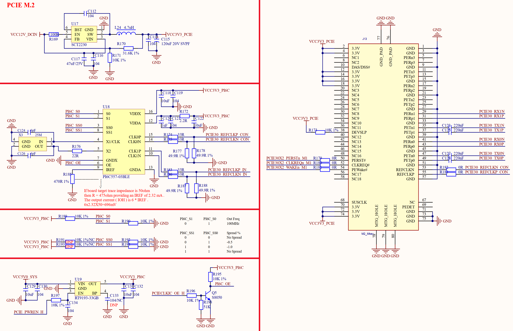

# 3.30 PCIE SSD接口

&emsp;&emsp;正点原子ATK-DLRK3568开发板板载一个PCIE SSD接口，原理如图如图3.30.1所示：

 
图3.30.1 PCIE SSD接口电路

&emsp;&emsp;图3.30.1中J13就是PCIE SSD接口，为M.2 B_Key接口类型。可以连接常用的2280 M.2 SSD固态硬盘。U18这个PI6C557-03BLE是PCIE时钟芯片。U17是一个DCDC电源芯片，给PCIE提供一路专用的3.3V电压。U19是一个LDO电源芯片，提供一路3.3V电源给PCIE时钟芯片。
