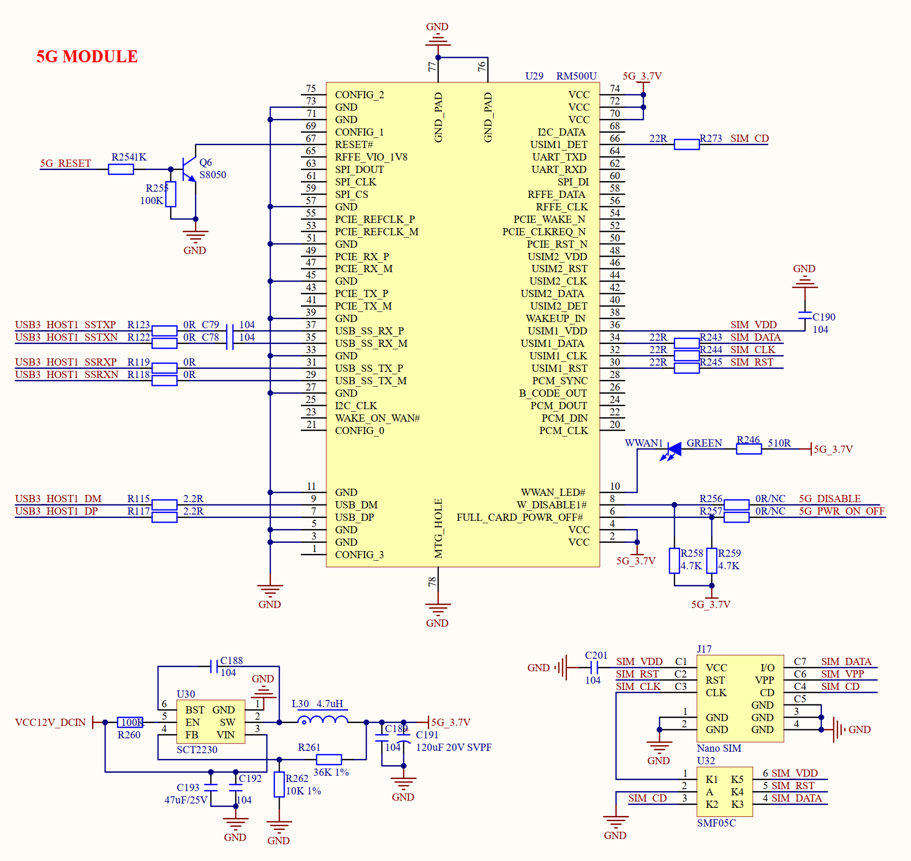

# 3.31 5G模块接口

&emsp;&emsp;正点原子ATK-DLRK3568开发板板载5G接口，如图3.31.1所示：

 
图3.31.1 5G模块

&emsp;&emsp;U29就是M_Key接口的5G模块座子，用于连接5G模块，比如移远的RM500U模块。J17是Nano SIM卡座，用于插入Nano SIM卡。虽然5G模组采用M_Key接口，但是实际走的USB接口，5G模组需要连接到USB3.0接口上。
