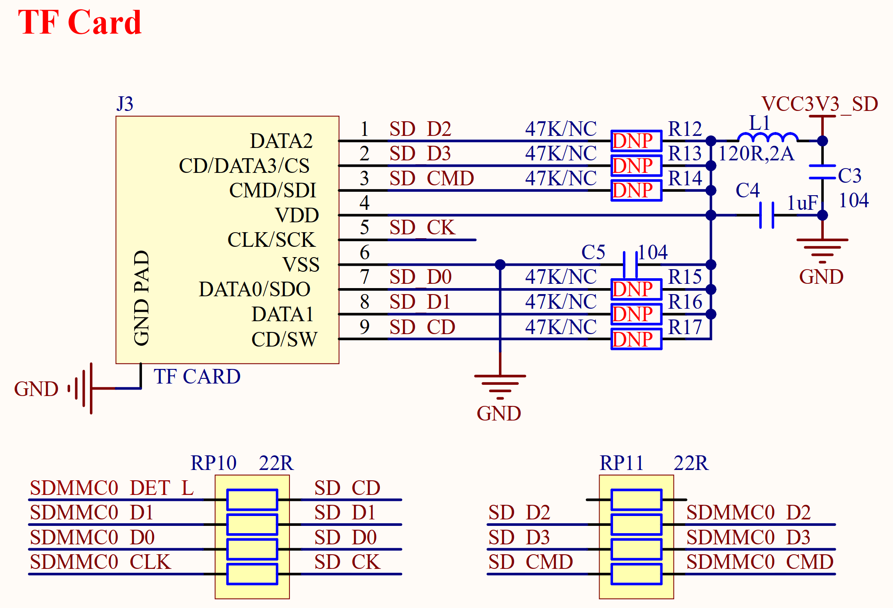

# 3.32 TF卡接口

&emsp;&emsp;正点原子ATK-DLRK3568开发板板载了一个TF卡（小卡）接口，其原理图如图3.32.1所示：

 
图3.32.1 TF卡接口 

&emsp;&emsp;图中TF_CARD为TF卡接口，TF卡采用4位SDMMC方式驱动，非常适合需要高速存储的情况。图中：SDMMC0_D0~D3/SDMMC0_CLK/SDMMC0_CMD分别连接在RK3568的GPIO1_D5、GPIO1_D6、GPIO1_D7、GPIO2_A0、GPIO2_A2和GPIO2_A1引脚上。 SDMMC0_DET是TF卡检测引脚，用于检测TF卡插拔过程，连接到RK3568的GPIO0_A4引脚上。
