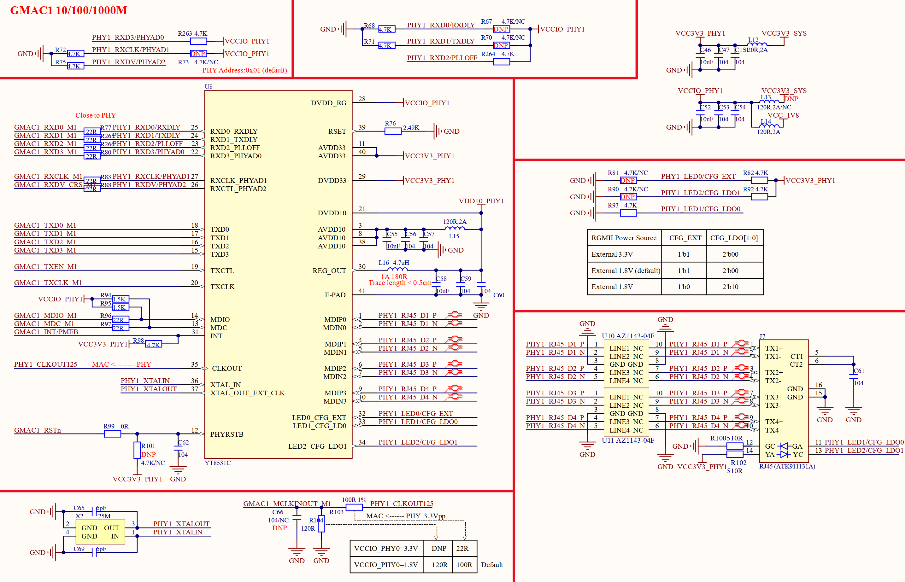

# 3.4 千兆网络接口ETH1

&emsp;&emsp;开发板上ETH1这个千M以太网接口原理图如图3.4.1所示：

 
图3.4.1 ETH0千M兆网络原理图

&emsp;&emsp;RK3568的ETH0需要外接一个支持千M网络的PHY芯片实现千M网络联网，图中U8就是一颗10/100/1000M的PHY芯片，型号为YT8531C，Pin to Pin兼容RTL8211F，因此在我们的开发板上YT8531C和RTL8211F可以随意互换。

&emsp;&emsp;图中J7就是支持千M网络的RJ45座，型号为ATK91131A，此RJ45座内部集成了网络变压器，所以大家在图3.4.1中并没有看到网络变压器。如果开发板要工作在千M模式，对方设备也必须工作在千M模式，如果对方设备工作在10/100M模式，那么开发板PHY芯片会通过自动协商也降低到10/100M模式。

