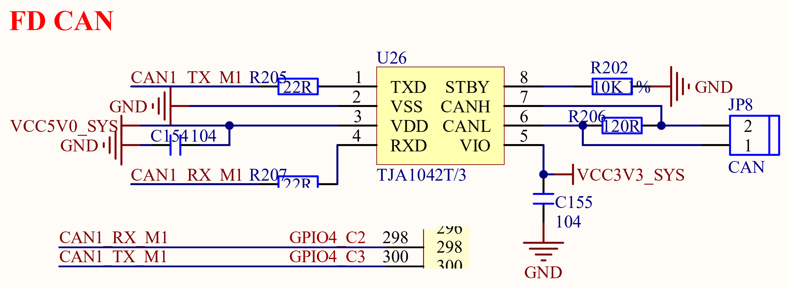

# 3.8 CAN接口

&emsp;&emsp;ATK-DLRK3568开发板板载1路CAN接口电路如图3.8.1所示：

 
图 3.8.1 CAN接口电路

&emsp;&emsp;CAN总线电平也不能直接连接到RK3568对应引脚上，而且RK3568的CAN接口支持CAN FD模式，这里我们使用TJA1042T/3来做CAN电平转换，其中R206为终端匹配电阻。

&emsp;&emsp;CAN1_RX_M1/CAN1_TX_M1直接连接在RK3568的GPIO4_C2和GPIO4_C3上面。

