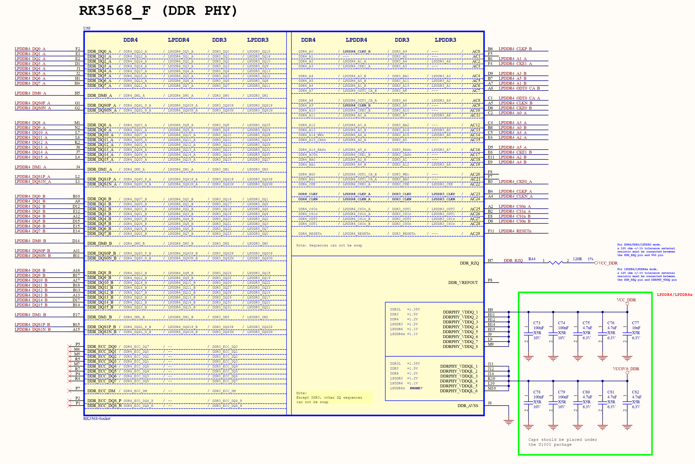

# 4.1 SOC	

&emsp;&emsp;正点原子ATK-DLRK3568开发板配套的ATK-CLRK3568F核心板，采用瑞芯微的RK3568作为主控MPU，RK3568主要特点如下：

&emsp;&emsp;1、四核Cortex-A55，2.0GHz。每个核自带32KB的L1 I-Cache和32KB的L1 D-Cache、四核共享512KB的L3 Cache。

&emsp;&emsp;2、集成NEON和FPU，加速多媒体和信号处理。

&emsp;&emsp;3、集成0.8 TOPS NPU单元，支持INT8/INT16，支持TensorFlow、TF-lite、Pytorch、Caffe、ONNX、MXNet、Keras和Darknet。

&emsp;&emsp;4、集成Mali-G52 3D GPU单元，支持OpenGL ES 1.1、2.0和3.2，支持Vulkan 1.0和1.1，支持OpenCL 2.0。GPU主频800M的时候，像素填充率为1600Mpix/S。GPU 800M主频下GPU算了为38.4GLOPS。

&emsp;&emsp;5、支持外扩DDR3/DDR3L/DDR4/LPDDR3/LPDDR4/LPDDR4X、SPI Nor/Nand Flash、EMMC、SD卡。

&emsp;&emsp;6、内部集成硬件视频解码器，支持H265 HEVC/MVC，最高支持4K(4096x2304)@60fps。支持H264 AVC/MVC，最高支持4K(4096x2304)@60fps。支持VP9，最高支持4K(4096x2304)@60fps。VP8最高支持1920x1080@60fps。还支持VC1、MPEG-4、MPEG-2、MPEG-1和H.263等。

&emsp;&emsp;7、内部集成硬件视频编码器，支持H.264/AVC，最高支持1920x1080@100fps。H.265/HEVC 1920x1080@100fps。

&emsp;&emsp;8、内部集成硬件JPEG编解码，编码的时候最高支持8192x8192分辨率，解码的时候最高支持8176x8176分辨率。

&emsp;&emsp;9、内部集成图像处理单元IEP模块。

&emsp;&emsp;10、内置2D图像引擎RGA。

&emsp;&emsp;11、内部集成多个视频输入接口，包括1个MIPI CSI接口，支持4 Lanes模式，MIPI CIS最高速率2.5Gbps/lane。1个DVP接口，支持8/10/12/16bits，最大速率150MHz。

&emsp;&emsp;4、1个支持8/10/12bit的标准DVP接口，输入数据最高支持150MHz。

&emsp;&emsp;5、内部集成ISP，最大支持8M像素，支持DVP或MIPI CSI输入，支持3A、FPN、BLC、HDR、3DLUT等功能。

&emsp;&emsp;12、内部集成多个显示接口：24bit的RGB LCD接口，最高支持1920x1080@60Hz。2个4 Lanes的MIPI DSI接口，单MIPI模式下最高支持1080P@60fps，双MIPI模式下最高支持2560x1440@60Hz。1个LVDS接口，支持RGB888和RGB565。1个HDMI接口，最高支持1080p@120Hz或4096x2304@60Hz。1个4Lanes EDP接口，2.7Gbps/lane，最高支持2560x1600@60Hz。

&emsp;&emsp;13、1个10/100/1000M以太网接口

&emsp;&emsp;14、2个USB 2.0 HOST接口。

&emsp;&emsp;15、1个USB 3.0 HOST接口，一个USB 3.0 OTG接口。

&emsp;&emsp;16、1个PCIE 3.0接口，PCIE 2.1接口。

&emsp;&emsp;17、1个SATA接口。

&emsp;&emsp;18、4个SPI接口。

&emsp;&emsp;19、6个IIC接口。

&emsp;&emsp;20、10个UART接口。

&emsp;&emsp;暂时只列举这些特性，至于RK3568更加详细的介绍请参考RK3568数据手册。

&emsp;&emsp;SOC部分的原理图如图4.1.1~图4.1.8（因为原理图比较大，缩小下来可能有点看不清，请大家打开开发板光盘的原理图进行查看）所示：

 
图4.1.1 SOC部分原理图1

 
图4.1.2 SOC部分原理图2

 
图4.1.3 SOC部分原理图3

 
图4.1.4 SOC部分原理图4

 
图4.1.5 SOC部分原理图5

 
图4.1.6 SOC部分原理图6

 
图4.1.7 SOC部分原理图7

 
图4.1.8 SOC部分原理图8

 
图4.1.9 SOC部分原理图9

 
图4.1.10 SOC部分原理图10

 
图4.1.11 SOC部分原理图11

 
图4.1.12 SOC部分原理图12

&emsp;&emsp;RK3568芯片的原理图由8个部分组成，接下来依次看一下这8部分的功能： 
&emsp;&emsp;图4.1.1：此部分原理图主要是RK3568的VCCIO1域部分IO原理图，主要是I2S相关的IO。 
&emsp;&emsp;图4.1.2：此部分原理图主要是RK3568的DDR/LPDDR控制器部分IO原理图。 
&emsp;&emsp;图4.1.3：此部分原理图主要是RK3568的VCCIO2域部分IO原理图，主要是EMMC/FLASH相关的IO。 
&emsp;&emsp;图4.1.4：此部分原理图主要是RK3568的VCCIO3域部分IO原理图，主要是SDMMC相关的IO。 
&emsp;&emsp;图4.1.5：此部分原理图是RK3568的晶振、电源等部分原理图，也包括部分通用IO，比如I2C、PWM等。 
&emsp;&emsp;图4.1.6：此部分原理图是RK3568电源部分原理图。 
&emsp;&emsp;图4.1.7：此部分原理图是RK3568的VCCIO4/7和ADC部分原理图，主要是网络、串口、CAN和ADC等相关IO。 
&emsp;&emsp;图4.1.8：此部分原理图是RK3568的USB3.0/USB2.0/SATA/PCIE等接口部分IO原理图。 
&emsp;&emsp;图4.1.9：此部分原理图是RK3568的MIPI CSI部分原理图。 
&emsp;&emsp;图4.1.10：此部分原理图RK3568的VCCIO6域部分IO原理框图，主要是网络、SDMMC等通用IO。 
&emsp;&emsp;图4.1.11：此部分原理图是RK3568的MIPI-DSI、LVDS、eDP、HDMI接口部分IO原理图。 
&emsp;&emsp;图4.1.12：此部分原理图是RK3568的VCCIO6域部分IO原理框图，主要是一些通用IO。

