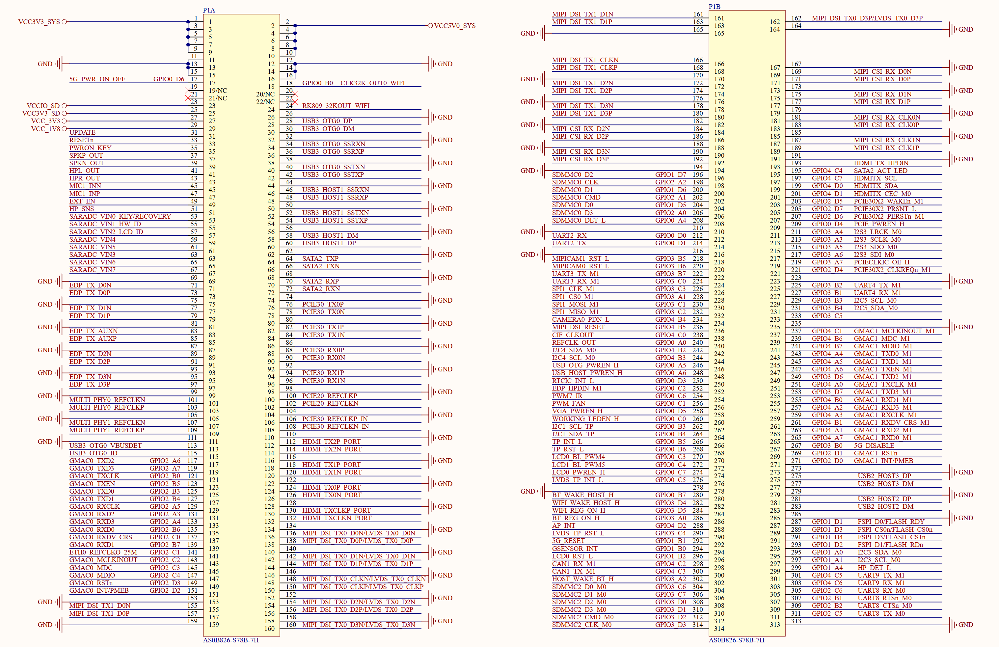

# 4.2 314P金手指接口	

&emsp;&emsp;ATK-CLRK3568F核心板采用314P金手指接口与底板连接，这是个通用的金手指，接插非常方便，核心板上金手指接口原理图如图4.2.1所示：

 
图4.2.1 314P金手指接口

&emsp;&emsp;由于314P插座太长了，所以在原理图里面分成了两部分：P1A和P1B，总计是314个引脚，在使用的时候将核心板插到底板上即可，使用起来非常方便。

