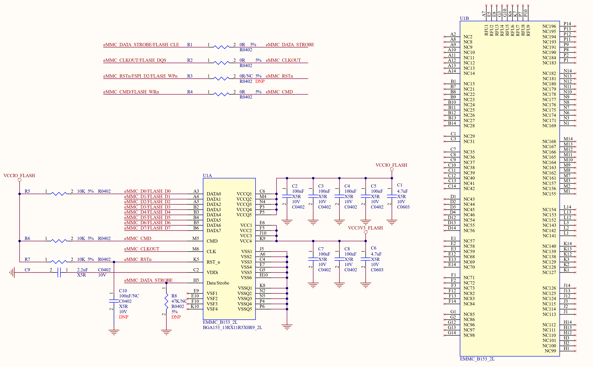

# 4.3 EMMC	

&emsp;&emsp;ATK-CLRK3568F核心板板载了32/64GB的EMMC，原理图如图4.3.1所示：

 
4.3.1 EMMC原理图

&emsp;&emsp;图4.3.1中U1为EMMC芯片，EMMC供电电源(VCC)为3.3V，但是IO电压(VCCQ)为1.8V。EMMC相比其他Flash，使用简单(和SD类似)、速度快、容量高。目前EMMC已经逐渐的取代了其他Flash，如NAND，尤其是在手机、平板领域。 

