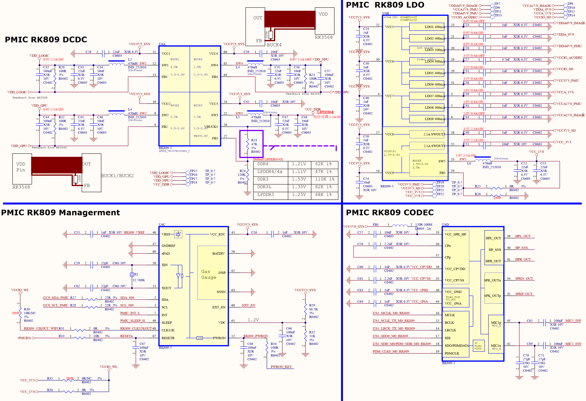
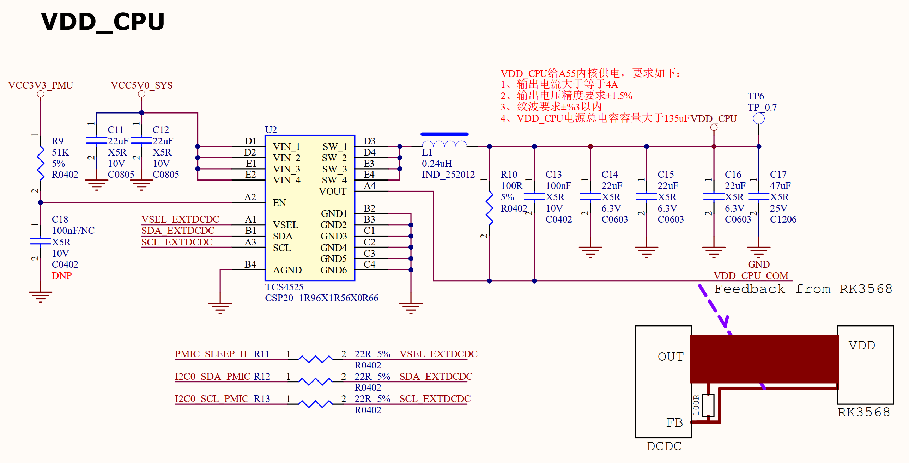

# 4.5 核心板电源 	

&emsp;&emsp;RK3568对于供电有严格的要求，尤其是上下电顺序，所以我们使用了RK3568配套的PMIC芯片来为整个核心板提供电源，PMIC型号为RK809-5。另外还有几个独立的电源芯片提供其他的电源，RK809-5和这些独立的电源IC构成了整个核心板供电，其原理图如图4.5.1和4.5.2所示：

 
图4.5.1 核心板PMIC电源

 
图4.5.2 CPU供电原理图

&emsp;&emsp;图4.5.1是RK809-5这颗PMIC的原理图，给核心板提供多路电源。图4.5.2中的U2是一颗DCDC电源芯片，给RK3568的CPU核心提供电源。

